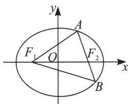

<!-- question-source:start -->
例13（2019·新课标Ⅰ）已知椭圆 C 的焦点为 $F_{1}(-1,0)$ ， $F_{2}(1,0)$ ，过 $F_{2}$ 的直线与 C 交于 A，B 两点．若 $\left|AF_{2}\right|=2\left|F_{2}B\right|$ ， $\left|AB\right|=\left|BF_{1}\right|$ ，则 C 的方程为
A. $\frac{x^{2}}{2} + y^{2} = 1$ B. $\frac{x^{2}}{3} + \frac{y^{2}}{2} = 1$ C. $\frac{x^{2}}{4} + \frac{y^{2}}{3} = 1$ D. $\frac{x^{2}}{5} + \frac{y^{2}}{4} = 1$

<!-- question-source:end -->

![[高中/总复习/专题/2026版高中《mst老唐说题》圆锥曲线专题（数学）/上册/第02章_离心率/第一节_弦长体系下的焦长模型与焦比定理/四_焦点弦构造等腰三角形速解策略/例题/answers/Q00048410A1.md]]
