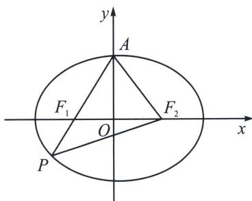

<!-- question-source:start -->
例14（2024·江苏南通海门区期中）设椭圆 $C: \frac{x^{2}}{a^{2}} + \frac{y^{2}}{b^{2}} = 1 (a > b > 0)$ 的上顶点为 $A$ ，左、右焦点分别为 $F_{1}, F_{2}$ ，连接 $AF_{1}$ 并延长交椭圆 $C$ 于点 $P$ ，若 $PA = PF_{2}$ ，则该椭圆的离心率为 \_\_\_\_.

<!-- question-source:end -->

![[高中/总复习/专题/2026版高中《mst老唐说题》圆锥曲线专题（数学）/上册/第02章_离心率/第一节_弦长体系下的焦长模型与焦比定理/四_焦点弦构造等腰三角形速解策略/例题/answers/Q00048411A1.md]]
