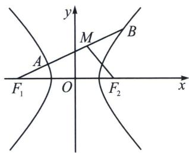
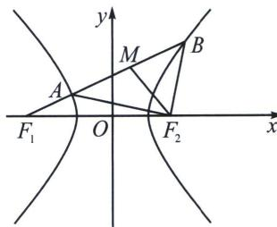

<!-- question-source:start -->
例17（2023·河南模拟）设双曲线 $E: \frac{x^2}{a^2} - \frac{y^2}{b^2} = 1 (a > 0, b > 0)$ 的左、右焦点分别为 $F_1, F_2, B$ 为双曲线 $E$ 上在第一象限内的点，线段 $F_1B$ 与双曲线 $E$ 相交于另一点 $A, AB$ 的中点为 $M$ ，且 $F_2M \perp AB$ ，若 $\angle AF_1F_2 = 30^\circ$ ，则双曲线 $E$ 的离心率为 ( )
A. $\sqrt{5}$ B. 2
C. $\sqrt{3}$ D. $\sqrt{2}$

<!-- question-source:end -->

![[高中/总复习/专题/2026版高中《mst老唐说题》圆锥曲线专题（数学）/上册/第02章_离心率/第一节_弦长体系下的焦长模型与焦比定理/四_焦点弦构造等腰三角形速解策略/例题/answers/Q00048415A1.md]]
