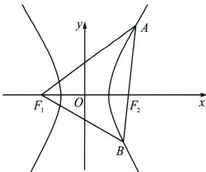

<!-- question-source:start -->
例15 (2024·广州模拟)已知双曲线 $E: \frac{x^2}{a^2} - \frac{y^2}{b^2} = 1 (a > 0, b > 0)$ 的左、右焦点分别为 $F_1, F_2$ , 过点 $F_2$ 的直线与双曲线 $E$ 的右支交于 $A, B$ 两点, 若 $|AB| = |AF_1|$ , 且双曲线 $E$ 的离心率为 $\sqrt{2}$ , 则 $\cos \angle BAF_1 =$ 高中数学 新思路 圆锥曲线专题 A. $-\frac{3\sqrt{7}}{8}$ B. $-\frac{3}{4}$ C. $\frac{1}{8}$ D. $-\frac{1}{8}$

<!-- question-source:end -->

![[高中/总复习/专题/2026版高中《mst老唐说题》圆锥曲线专题（数学）/上册/第02章_离心率/第一节_弦长体系下的焦长模型与焦比定理/四_焦点弦构造等腰三角形速解策略/例题/answers/Q00048940A1.md]]
