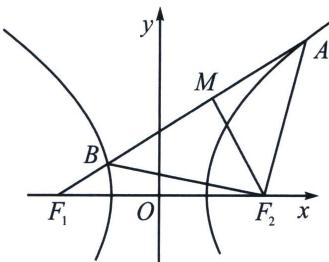

<!-- question-source:start -->
例15 (2024·广州模拟)已知双曲线 $E: \frac{x^2}{a^2} - \frac{y^2}{b^2} = 1 (a > 0, b > 0)$ 的左、右焦点分别为 $F_1, F_2$ , 过点 $F_2$ 的直线与双曲线 $E$ 的右支交于 $A, B$ 两点, 若 $|AB| = |AF_1|$ , 且双曲线 $E$ 的离心率为 $\sqrt{2}$ , 则 $\cos \angle BAF_1 =$ 高中数学 新思路 圆锥曲线专题 A. $-\frac{3\sqrt{7}}{8}$ B. $-\frac{3}{4}$ C. $\frac{1}{8}$ D. $-\frac{1}{8}$

2. 双曲线的 $4 a$ 底边等腰三角形

如图，若 $|F_{2}A| = |F_{2}B| = m$ 与 $|AB| = 4a$ 互为充要条件.

证明：（充分性） $\left|AF_{1}\right|=m+2a,\quad\left|BF_{1}\right|=m-2a$ ，故 $\left|AB\right|=\left|AF_{1}\right|-\left|BF_{1}\right|=4a.$

（必要性） $\left|BF_{2}\right|=2a+\left|BF_{1}\right|$ ， $\left|AF_{2}\right|=\left|AF_{1}\right|-2a=\left|AB\right|+\left|BF_{1}\right|-2a=2a+\left|BF_{1}\right|$ ，故

<!-- source-part:2 pages:81-160 -->

$$
\mid F _ {2} A \mid = \mid F _ {2} B \mid
$$

核心技能： $|AB| = 4a = \frac{2ab^2}{c^2\cos^2\alpha - a^2}\Rightarrow e^2 (\cos^2\alpha -\sin^2\alpha) = 1\Rightarrow e^2 = \frac{1 + k^2}{1 - k^2}$
<!-- question-source:end -->

![[高中/总复习/专题/2026版高中《mst老唐说题》圆锥曲线专题（数学）/上册/第02章_离心率/第一节_弦长体系下的焦长模型与焦比定理/四_焦点弦构造等腰三角形速解策略/例题/answers/Q00048940A1.md]]
