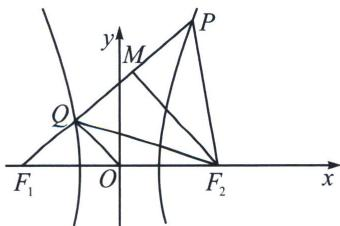

> [!faq]- 《圆锥曲线专题(上册)》例题解析
>
> > [!success]- **【答案】** B
>
> > [!note]- **【分析】**
> > 本题未单列分析。
>
> > [!note]- **【解析】**
> > 解析 如图所示，由双曲线的定义可知： $\left|PF_{1}\right|-\left|PF_{2}\right|=\left|PQ\right|+\left|QF_{1}\right|-\left|PF_{2}\right|=2a$
> > 
> > 所以 $|QF_{1}|=2a$ ，有 $|QF_{2}|=2a+|QF_{1}|=4a$ ，因为 $S_{\triangle PF_{1}F_{2}}=6S_{\triangle OF_{1}Q}$ ，即 $\frac{\frac{1}{2}\sin\angle PF_{1}F_{2}\cdot|PF_{1}|\cdot|F_{1}F_{2}|}{\frac{1}{2}\sin\angle PF_{1}F_{2}\cdot|QF_{1}|\cdot|OF_{1}|}=$ $\frac{2|PF_{1}|}{|QF_{1}|}=6$ ，所以 $|PQ|=2|QF_{1}|=4a$ ，则 $\triangle PQF_{2}$ 为等边三角形， $|PF_{1}|=6a,\quad|PF_{2}|=4a$ ，作 $MF_{2}\perp PQ,\quad|MF_{2}|=2\sqrt{3}a,\quad|MF_{1}|=4a$ ，所以 $\frac{|MF_{2}|}{|MF_{1}|}=\tan\angle PF_{1}F_{2}=\frac{\sqrt{3}}{2},\quad|PQ|=4a=\frac{2ab^{2}}{c^{2}\cos^{2}\alpha-a^{2}}\Rightarrow e^{2}(\cos^{2}\alpha-\sin^{2}\alpha)=1\Rightarrow e^{2}=\frac{1+k^{2}}{1-k^{2}},\quad e=\sqrt{7}$ ．
> >
> > 故选 **B**.
