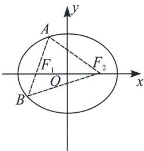
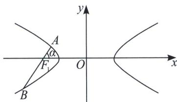
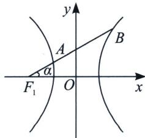

## 第一节 弦长体系下的焦长模型与焦比定理

## 1. 椭圆的焦比定理

A 是椭圆 $\frac{x^{2}}{a^{2}} + \frac{y^{2}}{b^{2}} = 1 (a > b > 0)$ 上一点， $F_{1}$ 、 $F_{2}$ 是左、右焦点， $\angle AF_{1}F_{2}$ 为 $\alpha$ ，AB 过 $F_{1}$ ，c 是椭圆半焦距，如图，则 $\left|AF_{1}\right| = \frac{b^{2}}{a - c\cos\alpha}$ ①； $\left|BF_{1}\right| = \frac{b^{2}}{a + c\cos\alpha}$ ②； $\left|AB\right| = \frac{2ab^{2}}{a^{2} - c^{2}\cos^{2}\alpha} = \frac{2ab^{2}}{b^{2} + c^{2}\sin^{2}\alpha}$ ③.

焦比定理：过椭圆 $\frac{x^{2}}{a^{2}}+\frac{y^{2}}{b^{2}}=1$ 的左焦点 $F_{1}$ 的弦，令 $|AF_{1}|=\lambda|F_{1}B|$ ， $\frac{b^{2}}{a-c\cos\alpha}=\frac{\lambda b^{2}}{a+c\cos\alpha}\Rightarrow e\cos\alpha=\frac{\lambda-1}{\lambda+1}$ ④，代入焦长公式①可得 $|AF_{1}|=\frac{(\lambda+1)b^{2}}{2a}$ ， $|BF_{1}|=\frac{(\lambda+1)b^{2}}{2\lambda a}$ ⑤.

这样组合①②③④⑤，焦点弦问题才能形成闭环.

## 2. 双曲线焦比定理之交一支类型

A、B 是双曲线 $\frac{x^{2}}{a^{2}} - \frac{y^{2}}{b^{2}} = 1$ 左支上两点， $F_{1}$ 是左焦点， $\angle AF_{1}O$ 为 $\alpha$ ，AB 过 $F_{1}$ ，c 是双曲线半焦距，如图，则 $\left|AF_{1}\right| = \frac{b^{2}}{a + c\cos\alpha}$ ①； $\left|BF_{1}\right| = \frac{b^{2}}{a - c\cos\alpha}$ ②；（根据长减短加判断符号） $\left|AB\right| = \frac{2ab^{2}}{a^{2} - c^{2}\cos^{2}\alpha}$ ③。

令 $\left|AF_{1}\right| = \lambda \left|F_{1}B\right|$ ，即 $\frac{b^{2}}{a + c\cos\alpha} = \frac{\lambda b^{2}}{a - c\cos\alpha} \Rightarrow e\cos\alpha = \frac{1 - \lambda}{\lambda + 1} (0 < \lambda < 1)$ ④（如果 $\lambda > 1$ ，有 $e\cos\alpha = \frac{\lambda - 1}{\lambda + 1}$ ），代入弦长公式可得 $\left|AF_{1}\right| = \frac{(\lambda + 1)b^{2}}{2a}$ ， $\left|BF_{1}\right| = \frac{(\lambda + 1)b^{2}}{2\lambda a}$ ⑤（与椭圆一致）。

## 3. 双曲线焦比定理之交两支类型

A 是双曲线 $\frac{x^{2}}{a^{2}} - \frac{y^{2}}{b^{2}} = 1$ 左支上一点，B 是双曲线右支上一点， $F_{1}$ 是左焦点， $\angle AF_{1}O$ 为 $\alpha$ ，AB 过 $F_{1}$ ，c 是双曲线半焦距，如图，由于交两支时，有 $|k| < \frac{b}{a}$ ，平方得： $\tan^{2}\alpha < \frac{b^{2}}{a^{2}}$ ，即 $\cos\alpha > \frac{a}{c}$ ，故 $a - c\cos\alpha < 0$ $|AF_{1}| = \frac{b^{2}}{a + c\cos\alpha}$ ①； $|BF_{1}| = \frac{b^{2}}{c\cos\alpha - a}$ ②；（根据长减短加判断符号） $|AB| = \frac{2ab^{2}}{c^{2}\cos^{2}\alpha - a^{2}}$ ③。

令 $|BF_{1}| = \lambda |AF_{1}|$ ，即 $\frac{b^{2}}{c\cos\alpha - a} = \frac{\lambda b^{2}}{a + c\cos\alpha} \Rightarrow e\cos\alpha = \frac{\lambda + 1}{\lambda - 1} (\lambda > 1)$ ④

代入弦长公式可得 $|BF_{1}| = \frac{(\lambda - 1)b^{2}}{2a}$ ， $|AF_{1}| = \frac{(\lambda - 1)b^{2}}{2\lambda a}$ ⑤。

![[高中/总复习/专题/2026版高中《mst老唐说题》圆锥曲线专题（数学）/上册/第02章_离心率/第一节_弦长体系下的焦长模型与焦比定理/一_通径相关的离心率/一_通径相关的离心率.md]]
![[高中/总复习/专题/2026版高中《mst老唐说题》圆锥曲线专题（数学）/上册/第02章_离心率/第一节_弦长体系下的焦长模型与焦比定理/二_焦点弦的化斜为直/二_焦点弦的化斜为直.md]]
![[高中/总复习/专题/2026版高中《mst老唐说题》圆锥曲线专题（数学）/上册/第02章_离心率/第一节_弦长体系下的焦长模型与焦比定理/三_焦点弦比值与离心率/三_焦点弦比值与离心率.md]]
![[高中/总复习/专题/2026版高中《mst老唐说题》圆锥曲线专题（数学）/上册/第02章_离心率/第一节_弦长体系下的焦长模型与焦比定理/四_焦点弦构造等腰三角形速解策略/四_焦点弦构造等腰三角形速解策略.md]]
![[高中/总复习/专题/2026版高中《mst老唐说题》圆锥曲线专题（数学）/上册/第02章_离心率/第一节_弦长体系下的焦长模型与焦比定理/五_椭圆与双曲线的焦弦直角体与离心率/五_椭圆与双曲线的焦弦直角体与离心率.md]]
![[高中/总复习/专题/2026版高中《mst老唐说题》圆锥曲线专题（数学）/上册/第02章_离心率/第一节_弦长体系下的焦长模型与焦比定理/六_焦点弦的平行四边形对称化构造/六_焦点弦的平行四边形对称化构造.md]]
