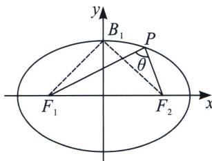

## 一、短轴端点处 $\angle F_{1}PF_{2}$ 张角最大

这是我们之前就介绍过得内容，已知椭圆 $\frac{x^2}{a^2} +\frac{y^2}{b^2} = 1(a > b > 0)$ 的左、右两焦点分别为 $F_{1}$ 、 $F_{2}$ ，若椭圆上存在一点 $P$ ，使得 $\angle F_1PF_2 = \theta$ ，则椭圆离心率 $e\in \left[\sin \frac{\theta}{2},1\right)$

证明：如图，设 $B_{1}$ 为椭圆的短轴顶点，假设椭圆上存在一点 $P$ ，使得 $\angle F_{1}PF_{2} = \theta$ ，则必有 $\angle F_{1}B_{1}F_{2} \geqslant \theta$ ，又 $e = \sin \frac{\angle F_{1}B_{1}F_{2}}{2}$ ，由于 $\frac{\theta}{2} \leqslant \frac{\angle F_{1}B_{1}F_{2}}{2} < \frac{\pi}{2}$ ，故 $e \in \left[\sin \frac{\theta}{2}, 1\right)$ .

![[高中/总复习/专题/2026版高中《mst老唐说题》圆锥曲线专题（数学）/上册/第02章_离心率/第三节_长度与角度下的离心率范围约束/一_短轴端点处_angle_F__1_PF__2__张角最大/例题/Q00048444.md]]
![[高中/总复习/专题/2026版高中《mst老唐说题》圆锥曲线专题（数学）/上册/第02章_离心率/第三节_长度与角度下的离心率范围约束/一_短轴端点处_angle_F__1_PF__2__张角最大/例题/Q00048445.md]]
![[高中/总复习/专题/2026版高中《mst老唐说题》圆锥曲线专题（数学）/上册/第02章_离心率/第三节_长度与角度下的离心率范围约束/一_短轴端点处_angle_F__1_PF__2__张角最大/例题/Q00048446.md]]
![[高中/总复习/专题/2026版高中《mst老唐说题》圆锥曲线专题（数学）/上册/第02章_离心率/第三节_长度与角度下的离心率范围约束/一_短轴端点处_angle_F__1_PF__2__张角最大/例题/Q00048447.md]]
