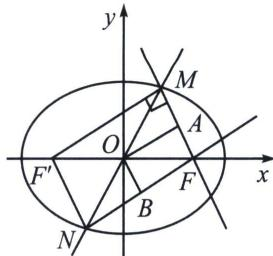

<!-- question-source:start -->
例2 (2024·多选·山东一模)已知椭圆 $C: \frac{x^{2}}{a^{2}} + \frac{y^{2}}{b^{2}} = 1 (a > b > 0)$ 的右焦点为 $F, M(x_{1}, y_{1}), N(-x_{1}, -y_{1})$ 在椭圆 $C$ 上但不在坐标轴上，若 $\overrightarrow{FM} = 2\overrightarrow{FA}, \overrightarrow{FN} = 2\overrightarrow{FB}$ ，且 $\overrightarrow{OA} \perp \overrightarrow{OB}$ ，则椭圆 $C$ 的离心率的值可以是（）
A. $\frac{1}{2}$ B. $\frac{\sqrt{2}}{2}$ C. $\frac{\sqrt{3}}{2}$ D. $\frac{9}{10}$

<!-- question-source:end -->

![[高中/总复习/专题/2026版高中《mst老唐说题》圆锥曲线专题（数学）/上册/第02章_离心率/第三节_长度与角度下的离心率范围约束/一_短轴端点处_angle_F__1_PF__2__张角最大/例题/answers/Q00048445A1.md]]
