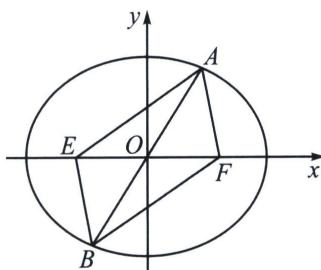

<!-- question-source:start -->
例4 (2023·浙江模拟)已知椭圆 $C: \frac{x^{2}}{a^{2}} + \frac{y^{2}}{b^{2}} = 1 (a > b > 0)$ 的右焦点为 $F$ , 过坐标原点 $O$ 的直线 $l$ 与椭圆 $C$ 交于 $A, B$ 两点. 在 $\triangle AFB$ 中, $\angle AFB = 120^{\circ}$ , 且满足 $S_{\triangle AFB} \geqslant \frac{1}{2} ac$ , 则椭圆 $C$ 的离心率 $e$ 的取值范围为 \_\_\_\_.

<!-- question-source:end -->

![[高中/总复习/专题/2026版高中《mst老唐说题》圆锥曲线专题（数学）/上册/第02章_离心率/第三节_长度与角度下的离心率范围约束/一_短轴端点处_angle_F__1_PF__2__张角最大/例题/answers/Q00048447A1.md]]
