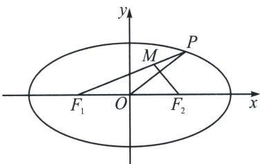

<!-- question-source:start -->
例9 (河南省豫西重点高中 2024-2025 学年高三下学期 5 月联考 T14) 已知椭圆 $C: \frac{x^{2}}{a^{2}} + \frac{y^{2}}{b^{2}} = 1 (a > b > 0)$ 的左、右焦点分别为 $F_{1}, F_{2}, P$ 是 $C$ 上异于长轴端点的一点，点 $M$ 满足 $\overrightarrow{PF_{1}} = 3\overrightarrow{PM}, \overrightarrow{MF_{2}} \cdot \overrightarrow{OP} = 0, O$ 为坐标原点，则 $C$ 的离心率的取值范围是 \_\_\_\_.

<!-- question-source:end -->

![[高中/总复习/专题/2026版高中《mst老唐说题》圆锥曲线专题（数学）/上册/第02章_离心率/第三节_长度与角度下的离心率范围约束/三_向量乘积与极化恒等式的约束/例题/answers/Q00048452A1.md]]
