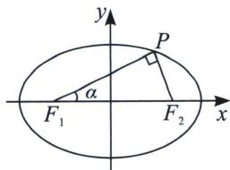
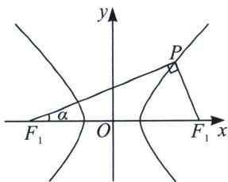

## 二、直角 $\angle F_{1}PF_{2}$ 的约束

椭圆篇： $\left|PF_{2}\right|=2c\sin\alpha,\quad\left|PF_{1}\right|=2c\cos\alpha$ ，有 $\left|PF_{1}\right|+\left|PF_{2}\right|=2a$ ，带入可得 $2c\sin\alpha+2c\cos\alpha=2a$ ，求得 $e=\frac{1}{\sin\alpha+\cos\alpha}=\frac{1}{\sqrt{2}\sin\left(\alpha+\frac{\pi}{4}\right)}$ ，根据 $\alpha$ 范围求解值域.

双曲线篇：双曲线同样存在类似定理，如上右图 $|PF_{2}| = 2c\sin \alpha$ ， $|PF_{1}| = 2c\cos \alpha$ ，有 $|PF_{1}| - |PF_{2}| = 2a$ ，带入可得 $2c\cos \alpha - 2c\sin \alpha = 2a$ ，求得 $e = \frac{1}{\cos \alpha - \sin \alpha} = \frac{1}{\sqrt{2}\cos\left(\alpha + \frac{\pi}{4}\right)}$

![[高中/总复习/专题/2026版高中《mst老唐说题》圆锥曲线专题（数学）/上册/第02章_离心率/第三节_长度与角度下的离心率范围约束/二_直角_angle_F__1_PF__2__的约束/例题/Q00048448.md]]
![[高中/总复习/专题/2026版高中《mst老唐说题》圆锥曲线专题（数学）/上册/第02章_离心率/第三节_长度与角度下的离心率范围约束/二_直角_angle_F__1_PF__2__的约束/例题/Q00048449.md]]
