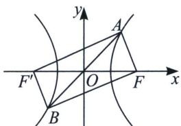

<!-- question-source:start -->
例6 (2022·湖南期末)已知双曲线 $C: \frac{x^{2}}{a^{2}} - \frac{y^{2}}{b^{2}} = 1 (a > b > 0)$ 右支上非顶点的一点 $A$ 关于原点 $O$ 的对称点为 $B, F$ 为其右焦点, 若 $\overrightarrow{AF} \cdot \overrightarrow{BF} = 0$ , 设 $\angle BAF = \theta$ , 且 $\theta \in \left(\frac{\pi}{4}, \frac{5\pi}{12}\right)$ , 则双曲线 $C$ 离心率的取值范围是 ( )
A. ( $\sqrt{2}$ , 2] B. $[\sqrt{2}, +\infty)$ C. ( $\sqrt{2}$ , $+\infty$ ) D. (2, $+\infty$ )

<!-- question-source:end -->

![[高中/总复习/专题/2026版高中《mst老唐说题》圆锥曲线专题（数学）/上册/第02章_离心率/第三节_长度与角度下的离心率范围约束/二_直角_angle_F__1_PF__2__的约束/例题/answers/Q00048449A1.md]]
