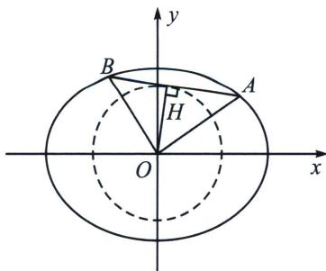

## 五、圆心角 $\angle AOB$ 为直角在椭圆内的约束

1. 椭圆 $\frac{1}{d^2} = \frac{1}{a^2} + \frac{1}{b^2}$

已知椭圆 $\frac{x^{2}}{a^{2}}+\frac{y^{2}}{b^{2}}=1(a>b>0)$ ，O为坐标原点，AB为椭圆上的两动点，且 $OA\perp OB$ ，则原点到AB的

距离 $d = |OH|$ 为定值，且 $\frac{1}{d^{2}} = \frac{1}{a^{2}} + \frac{1}{b^{2}}$ .

证明：设 $AB: mx + ny = 1$ ，则 $\frac{x^2}{a^2} + \frac{y^2}{b^2} = (mx + ny)^2$ ，即 $\frac{x^2}{a^2} - m^2 x^2 - 2mnxy + \frac{y^2}{b^2} - n^2 y^2 = 0$ ，当 $x \neq 0$ 时，两边除以 $x^2$ 得： $\left(\frac{1}{b^2} - n^2\right)\frac{y^2}{x^2} - 2mn\frac{y}{x} + \frac{1}{a^2} - m^2 = 0$ ，所以 $k_{OA}, k_{OB}$ 是这个关于 $\frac{y}{x}$ 的方程的两个根。

由于 $k_{OA} \cdot k_{OB} = -1$ ，所以 $\frac{\frac{1}{a^2} - m^2}{\frac{1}{b^2} - n^2} = -1$ ，即 $\frac{1}{a^2} + \frac{1}{b^2} = m^2 + n^2$ ， $d^2 = \frac{1}{m^2 + n^2}$ ，即 $\frac{1}{d^2} = \frac{1}{a^2} + \frac{1}{b^2}$

当 $x = 0$ 时， $AB$ 方程为： $\pm \frac{x}{|a|} - \frac{y}{|b|} = 1$ 或 $\pm \frac{x}{a} + \frac{y}{b} = 1, \frac{1}{d^2} = \frac{1}{a^2} + \frac{1}{b^2}$ 一样成立.

![[高中/总复习/专题/2026版高中《mst老唐说题》圆锥曲线专题（数学）/上册/第02章_离心率/第三节_长度与角度下的离心率范围约束/五_圆心角_angle_AOB_为直角在椭圆内的约束/例题/Q00048941.md]]
![[高中/总复习/专题/2026版高中《mst老唐说题》圆锥曲线专题（数学）/上册/第02章_离心率/第三节_长度与角度下的离心率范围约束/五_圆心角_angle_AOB_为直角在椭圆内的约束/例题/Q00048461.md]]
![[高中/总复习/专题/2026版高中《mst老唐说题》圆锥曲线专题（数学）/上册/第02章_离心率/第三节_长度与角度下的离心率范围约束/五_圆心角_angle_AOB_为直角在椭圆内的约束/例题/Q00048462.md]]
