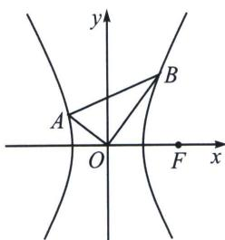

<!-- question-source:start -->
例17 (2024·聊城三模)已知双曲线 $C: \frac{x^{2}}{a^{2}} - \frac{y^{2}}{b^{2}} = 1 (b > a > 0)$ 的一个焦点为 $F, O$ 为坐标原点，点 $A, B$ 在双曲线上运动，以 $A, B$ 为直径的圆过点 $O$ ，且 $|\overrightarrow{OA} + \overrightarrow{OB}| |\overrightarrow{OF}| \leqslant |\overrightarrow{OA}||\overrightarrow{OB}|$ 恒成立，则 $C$ 的离心率的取值范围为 \_\_\_\_.

<!-- question-source:end -->

![[高中/总复习/专题/2026版高中《mst老唐说题》圆锥曲线专题（数学）/上册/第02章_离心率/第三节_长度与角度下的离心率范围约束/五_圆心角_angle_AOB_为直角在椭圆内的约束/例题/answers/Q00048462A1.md]]
