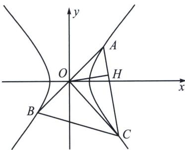

> [!faq]- 《圆锥曲线专题(上册)》例题解析
>
> > [!success]- **【答案】** A
>
> > [!note]- **【解析】**
> > 解析 如图，易知 $|OC| \perp AB$ ，且 $\frac{1}{|OH|^2} = \frac{1}{a^2} - \frac{1}{b^2} > 0$ ，所以 $b^2 > a^2$ ， $e = \frac{c}{a} = \sqrt{1 + \frac{b^2}{a^2}} > \sqrt{2}$ ，故选 A.
> >
> > 
