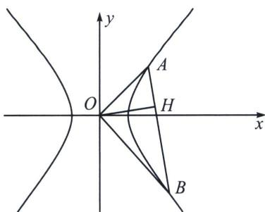

> [!faq]- 《圆锥曲线专题(上册)》例题解析
>
> > [!success]- **【答案】** $\left(0,\frac{\sqrt{5}-1}{2}\right)$
>
> > [!note]- **【解析】**
> > 解析 临界条件就是 $|OA|^{2}+|OB|^{2}=|AB|^{2}$ ，此时 $OA\perp OB$ ，这是经典的内切圆模型，此时原点到直线的距离 $d=r=\frac{ab}{\sqrt{a^{2}+b^{2}}}$ ，由于AB过焦点，故临界条件为 $\frac{ab}{\sqrt{a^{2}+b^{2}}}>c$ ，解得 $e^{2}>\frac{3+\sqrt{5}}{2}$ （舍）或 $e^{2}<\frac{3-\sqrt{5}}{2}$ 所以离心率 $e\in\left(0,\frac{\sqrt{5}-1}{2}\right)$ ，故答案为 $\left(0,\frac{\sqrt{5}-1}{2}\right)$ .
> >
> > 注意 关于内切圆，证明方法很多，我们这里介绍复数法，当 $OA \perp OB$ 时，令 $z_A = x_A + y_A i = r_1 (\cos \theta + i \sin \theta)$ ，所以 $A(r_1 \cos \theta, r_1 \sin \theta), z_B = x_B + y_B i = r_2 (\cos (\theta \pm \frac{\pi}{2}) + i \sin (\theta \pm \frac{\pi}{2}))$ ，所以 $B(r_2 \cos (\theta \pm \frac{\pi}{2}), r_2 \sin (\theta \pm \frac{\pi}{2}))$ ，即 $B(\mp r_2 \sin \theta, \pm r_2 \cos \theta))$ ， $\frac{r_1^2 \cos^2 \theta}{a^2} + \frac{r_1^2 \sin^2 \theta}{b^2} = 1 \Rightarrow \frac{1}{r_1^2} = \frac{\cos^2 \theta}{a^2} + \frac{\sin^2 \theta}{b^2}$ ，同理 $\frac{1}{r_2^2} = \frac{\sin^2 \theta}{a^2} + \frac{\cos^2 \theta}{b^2}$ ，两式相加得： $\frac{1}{r_1^2} + \frac{1}{r_2^2} = \frac{1}{a^2} + \frac{1}{b^2} = \frac{1}{d^2}$ ，故 $d = r = \frac{ab}{\sqrt{a^2 + b^2}}$ 。
> >
> > 2. 双曲线 $\frac{1}{d^2} = \frac{1}{a^2} - \frac{1}{b^2}$
> >
> > 已知双曲线 $\frac{x^2}{a^2} -\frac{y^2}{b^2} = 1(a > 0,b > 0)$ ， $O$ 为坐标原点， $AB$ 为椭圆上的两动点，且 $OA\bot OB$ ，则原点到 $AB$ 的距离 $d = |OH|$ 为定值，且 $\frac{1}{d^2} = \frac{1}{a^2} -\frac{1}{b^2}$
> >
> > 
> >
> > 证明：设 AB: $mx + ny = 1$ ，则 $\frac{x^{2}}{a^{2}} - \frac{y^{2}}{b^{2}} = (mx + ny)^{2}$ ，即 $\frac{x^{2}}{a^{2}} - m^{2}x^{2} - 2mnxy - \frac{y^{2}}{b^{2}} - n^{2}y^{2} = 0$ ，当 $x \neq 0$ 时，两边除以 $x^{2}$ 得： $\left(-\frac{1}{b^{2}} - n^{2}\right)\frac{y^{2}}{x^{2}} - 2mn\frac{y}{x} + \frac{1}{a^{2}} - m^{2} = 0$ ，所以 $k_{OA}$ ， $k_{OB}$ 是这个关于 $\frac{y}{x}$ 的方程的两个根.
> > 由于 $k_{OA} \cdot k_{OB} = -1$ ，所以 $\frac{\frac{1}{a^{2}} - m^{2}}{-\frac{1}{b^{2}} - n^{2}} = -1$ ，即 $\frac{1}{a^{2}} - \frac{1}{b^{2}} = m^{2} + n^{2}$ ， $d^{2} = \frac{1}{m^{2} + n^{2}}$ ，即 $\frac{1}{d^{2}} = \frac{1}{a^{2}} - \frac{1}{b^{2}}$ 当 x=0 时，AB 方程为： $\pm\frac{x}{|a|}-\frac{y}{|b|}=1$ 或 $\pm\frac{x}{a}+\frac{y}{b}=1,\quad\frac{1}{d^{2}}=\frac{1}{a^{2}}-\frac{1}{b^{2}}$ 一样成立.
