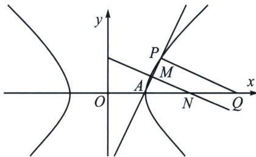

<!-- question-source:start -->
例18 (2023·MST 教师交流群讨论题)双曲线 $\frac{x^{2}}{a^{2}} - \frac{y^{2}}{b^{2}} = 1 (a > 0, b > 0)$ 的右顶点为 $A$ , $Q(3a, 0)$ 在 $x$ 轴上, 若 $C$ 上存在一点 $P$ (异于点 $A$ ) 使得 $AP \perp PQ$ , 则 $C$ 的离心率取值范围是 \_\_\_\_.

<!-- question-source:end -->

![[高中/总复习/专题/2026版高中《mst老唐说题》圆锥曲线专题（数学）/上册/第02章_离心率/第三节_长度与角度下的离心率范围约束/六_中垂线定理与离心率限定/例题/answers/Q00048463A1.md]]
