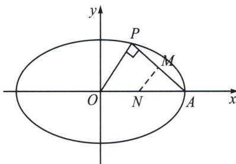

> [!faq]- 《圆锥曲线专题(上册)》例题解析
>
> > [!success]- **【答案】** $\left(\frac{\sqrt{2}}{2},1\right)$
>
> > [!note]- **【解析】**
> > 解析 如图所示，因为 $AP \perp OP$ ，设 $P(x_0, y_0)$ ，易知 $0 < x_0 < a$ ，则 $M\left(\frac{a + x_0}{2}, \frac{y_0}{2}\right)$ ， $N\left(\frac{a}{2}, 0\right)$ ， $\frac{a}{2}$ 为 $AP$ 中垂线的横截距，故我们可得： $\frac{a}{2} = \frac{c^2 x_M}{a^2} = e^2 \frac{x_0 + a}{2} < e^2 a$ ，所以 $e^2 > \frac{1}{2}$ ，椭圆的离心率 $e$ 的取值范围
> >
> > 为 $\left(\frac{\sqrt{2}}{2},1\right)$ . 故答案为 $\left(\frac{\sqrt{2}}{2},1\right)$ .
> >
> > 
