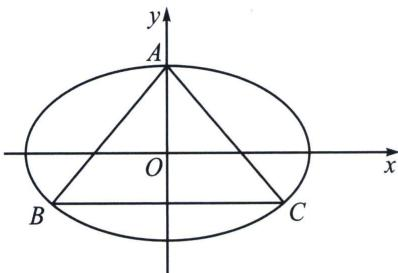
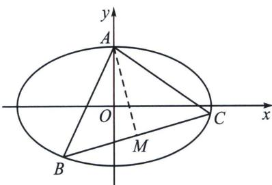

> [!faq]- 《圆锥曲线专题(上册)》例题解析
>
> > [!success]- **【答案】** 详见解析
>
> > [!note]- **【解析】**
> > 解析 解法一：不妨设直线BA: $y=kx+1(k>0)$ ，则直线BC: $y=-\frac{1}{k}x+1$ ，
> > 联立方程得 $\left\{\begin{aligned}y&=kx+1\\ \frac{x^{2}}{a^{2}}&=y^{2}=1\end{aligned}\right.$ ，得 $(1+a^{2}k^{2})x^{2}+2a^{2}kx=0$ ，所以 $x_{A}=-\frac{2a^{2}k}{1+a^{2}k^{2}}$ ，用 $-\frac{1}{k}$ 代替k得 $x_{c}=\frac{2a^{2}k}{a^{2}+k^{2}}$ ，
> > 所以 $|BA|=\sqrt{1+k^{2}}|x_{A}|=\frac{2a^{2}k\sqrt{1+k^{2}}}{1+a^{2}k^{2}}$ ， $|BC|=\sqrt{1+\frac{1}{k^{2}}}|x_{C}|=\frac{2a^{2}\sqrt{1+k^{2}}}{a^{2}+k^{2}}$ ，由 $|BA|=|BC|$ ，
> > 得 $(k-1)[k^{2}+(1-a^{2})k+1]=0$ ，该方程关于k已有一解k=1，由于符合条件的△ABC有且仅有一个，
> > 所以关于k的方程 $k^{2}+(1-a^{2})k+1=0$ 无实数解或有两个相等的实数解k=1，当方程无实数解时， $\left\{\begin{aligned}&a>1\\ &\Delta=(1-a^{2})^{2}-4<0\end{aligned}\right.$ ，解得 $1<a<\sqrt{3}$ ，当方程有两个相等的实数解k=1时， $\left\{\begin{aligned}&a>1\\ &1-a^{2}=-2\end{aligned}\right.$ ，解得 $a=\sqrt{3}$ ，
> > 所以 $1<a\leqslant\sqrt{3}$ ，则该椭圆的离心率 $e=\frac{c}{a}=\sqrt{\frac{c^{2}}{a^{2}}}=\sqrt{1-\frac{1}{a^{2}}}\in\left(0,\frac{\sqrt{6}}{3}\right]$ .
> >
> > 
> >
> > 
