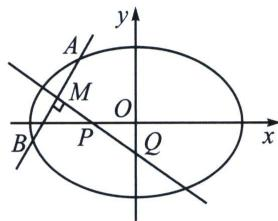

## 六、中垂线定理与离心率限定

中垂线截距定理: 若 $A 、 B$ 关于直线 $P Q$ 对称, 可以知道线段 $A B$ 被直线 $P Q$ 垂直平分, 其中 $P (n, 0)$ , $Q (0, m)$ 则能得出以下定理(不妨设焦点在 $x$ 轴上):

$m = -\frac{y_0c^2}{b^2}$ （椭圆）， $m = \frac{y_0c^2}{b^2}$ （双曲线）； $n = \frac{x_0c^2}{a^2}$ （椭圆）， $n = \frac{x_0c^2}{a^2}$ （双曲线）.

因为 $k_{AB} \cdot k_{OM} = -\frac{b^2}{a^2}$ （点差法）， $k_{AB} \cdot k_{PQ} = -1$ ，所以 $\frac{k_{OM}}{k_{PQ}} = \frac{b^2}{a^2}$ ，故 $\frac{\frac{y_0}{x_0}}{\frac{y_0 - m}{x_0}} = \frac{b^2}{a^2}$ ，即 $m = -\frac{y_0c^2}{b^2}$ ；同理 $\frac{\frac{y_0}{x_0}}{\frac{y_0}{x_0 - n}} = \frac{b^2}{a^2}$ ，即 $n = \frac{x_0c^2}{a^2}$ .

这是一个可解决大题，也可以解决小题的二级结论，任何一个问题我们需要去理解它的适用范围，如果好用，不妨多往这个方向考虑.

![[高中/总复习/专题/2026版高中《mst老唐说题》圆锥曲线专题（数学）/上册/第02章_离心率/第三节_长度与角度下的离心率范围约束/六_中垂线定理与离心率限定/例题/Q00048463.md]]
![[高中/总复习/专题/2026版高中《mst老唐说题》圆锥曲线专题（数学）/上册/第02章_离心率/第三节_长度与角度下的离心率范围约束/六_中垂线定理与离心率限定/例题/Q00048464.md]]
![[高中/总复习/专题/2026版高中《mst老唐说题》圆锥曲线专题（数学）/上册/第02章_离心率/第三节_长度与角度下的离心率范围约束/六_中垂线定理与离心率限定/例题/Q00048465.md]]
