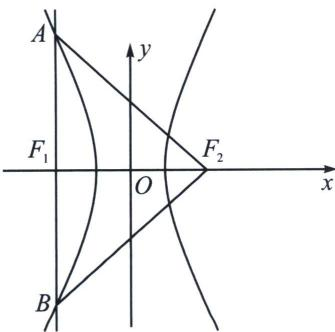
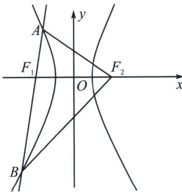

<!-- question-source:start -->
例13 (2023·广陵区期中)过双曲线 $\Gamma: \frac{x^{2}}{a^{2}} - \frac{y^{2}}{b^{2}} = 1 (a > 0, b > 0)$ 的左焦点 $F_{1}$ 的动直线 $l$ 与 $\Gamma$ 的左支交于 $A, B$ 两点，设 $\Gamma$ 的右焦点为 $F_{2}$ . 若存在直线 $l$ ，使得 $AF_{2} \perp BF_{2}$ ，则 $\Gamma$ 的离心率的取值范围是 \_\_\_\_.

<!-- question-source:end -->

![[高中/总复习/专题/2026版高中《mst老唐说题》圆锥曲线专题（数学）/上册/第02章_离心率/第三节_长度与角度下的离心率范围约束/四_弦长与角度范围约束/例题/answers/Q00048456A1.md]]
