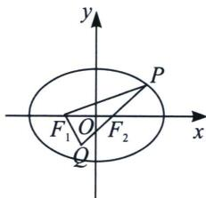

> [!faq]- 《圆锥曲线专题(上册)》例题解析
>
> > [!success]- **【答案】** C
>
> > [!note]- **【解析】**
> > 解析 如图， $QF_{1} \perp QP$ ，且 $Q$ 在椭圆内，临界条件为 $Q$ 在椭圆上，可得 $c < b$ ，即 $c^{2} < a^{2} - e^{2}$ ，解得 $e < \frac{\sqrt{2}}{2}$ ，又由于 $Q$ 在 $PF_{2}$ 的延长线上，满足 $QF_{1} \perp QP$ ，故临界条件为 $Q$ 与 $F_{2}$ 重合，此时 $|PF_{2}| = \frac{b^{2}}{a}$ ， $\tan \angle F_{1}PQ = \frac{2c}{\frac{b^{2}}{a}} = \frac{2ac}{a^{2} - c^{2}} = \frac{5}{12}$ ，故 $e > \frac{1}{5}$ ，所以 $e \in \left( \frac{1}{5}, \frac{\sqrt{2}}{2} \right)$ ，故选 C.
> >
> > 
