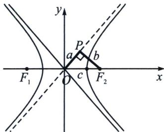
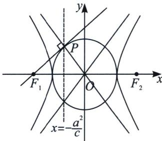

## 一、焦点到渐近线距离构造特征三角形

双曲线 $\frac{x^{2}}{a^{2}}-\frac{y^{2}}{b^{2}}=1(a>0,\ b>0)$ 的焦点到渐近线的距离为定值b，如左图所示，由于渐近线OP的斜率为

$\frac{b}{a}$ ，又 $|OF_2| = c$ ， $a^2 + b^2 = c^2$ ，显然 $PF_{2}$ 的长度是定值 $b$

如右图所示, 过双曲线 $\frac{x^{2}}{a^{2}} - \frac{y^{2}}{b^{2}} = 1 (a > 0, b > 0)$ 的左焦点 $F_{1}(-c, 0)(c > 0)$ 作圆 $x^{2} + y^{2} = a^{2}$ 的切线, 切点为 $P$ , 那么, 点 $P$ 在渐近线 $y = -\frac{b}{a} x$ 上, 也在左准线 $x = -\frac{a^{2}}{c}$ 上, 即点 $P\left(-\frac{a^{2}}{c}, \frac{ab}{c}\right)$ .

## 1. 利用对称性构造直角三角形

![[高中/总复习/专题/2026版高中《mst老唐说题》圆锥曲线专题（数学）/上册/第02章_离心率/第二节_几何性质下的渐近线模型/一_焦点到渐近线距离构造特征三角形/例题/Q00048427.md]]
![[高中/总复习/专题/2026版高中《mst老唐说题》圆锥曲线专题（数学）/上册/第02章_离心率/第二节_几何性质下的渐近线模型/一_焦点到渐近线距离构造特征三角形/例题/Q00048428.md]]
![[高中/总复习/专题/2026版高中《mst老唐说题》圆锥曲线专题（数学）/上册/第02章_离心率/第二节_几何性质下的渐近线模型/一_焦点到渐近线距离构造特征三角形/例题/Q00048429.md]]
![[高中/总复习/专题/2026版高中《mst老唐说题》圆锥曲线专题（数学）/上册/第02章_离心率/第二节_几何性质下的渐近线模型/一_焦点到渐近线距离构造特征三角形/例题/Q00048430.md]]
![[高中/总复习/专题/2026版高中《mst老唐说题》圆锥曲线专题（数学）/上册/第02章_离心率/第二节_几何性质下的渐近线模型/一_焦点到渐近线距离构造特征三角形/例题/Q00048431.md]]
![[高中/总复习/专题/2026版高中《mst老唐说题》圆锥曲线专题（数学）/上册/第02章_离心率/第二节_几何性质下的渐近线模型/一_焦点到渐近线距离构造特征三角形/例题/Q00048432.md]]
![[高中/总复习/专题/2026版高中《mst老唐说题》圆锥曲线专题（数学）/上册/第02章_离心率/第二节_几何性质下的渐近线模型/一_焦点到渐近线距离构造特征三角形/例题/Q00048433.md]]
