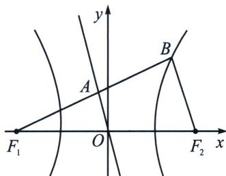

<!-- question-source:start -->
例3 (2024·漳州模拟)已知双曲线 $C: \frac{x^{2}}{a^{2}} - \frac{y^{2}}{b^{2}} = 1 (a > 0, b > 0)$ 左、右焦点分别为 $F_{1}, F_{2}$ , 过 $F_{1}$ 的直线与 $C$ 的渐近线 $l: y = -\frac{b}{a} x$ 及右支分别交于 $A, B$ 两点, 若 $\overrightarrow{F_{1} A} = \overrightarrow{A B}, \overrightarrow{F_{1} B} \cdot \overrightarrow{F_{2} B} = 0$ , 则 $C$ 的离心率为 ( )
A. $\frac{3}{2}$ B. 2
C. $\sqrt{5}$ D. 3

<!-- question-source:end -->

![[高中/总复习/专题/2026版高中《mst老唐说题》圆锥曲线专题（数学）/上册/第02章_离心率/第二节_几何性质下的渐近线模型/一_焦点到渐近线距离构造特征三角形/例题/answers/Q00048429A1.md]]
