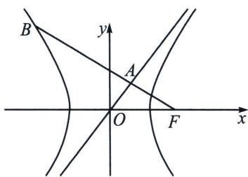

<!-- question-source:start -->
例4 (2024·厦门模拟)已知双曲线 $C: \frac{x^{2}}{a^{2}} - \frac{y^{2}}{b^{2}} = 1 (a > 0, b > 0)$ , 过右焦点 $F$ 作一条渐近线的垂线, 垂足为 $A$ , 点 $B$ 在 $C$ 上, 且 $\overrightarrow{FB} = 4\overrightarrow{FA}$ , 则 $C$ 的离心率为 $\frac{3\sqrt{2}}{2}$ B. $\frac{5}{3}$ C. 2 D. 3

<!-- question-source:end -->

![[高中/总复习/专题/2026版高中《mst老唐说题》圆锥曲线专题（数学）/上册/第02章_离心率/第二节_几何性质下的渐近线模型/一_焦点到渐近线距离构造特征三角形/例题/answers/Q00048430A1.md]]
