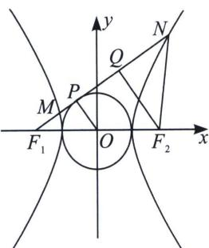
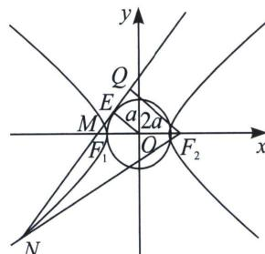

<!-- question-source:start -->
例6 (2022·多选·乙卷)双曲线 $C$ 的两个焦点为 $F_{1}, F_{2}$ , 以 $C$ 的实轴为直径的圆记为 $D$ , 过 $F_{1}$ 作 $D$ 的切线与 $C$ 交于 $M, N$ 两点, 且 $\cos \angle F_{1}NF_{2} = \frac{3}{5}$ , 则 $C$ 的离心率为 ( )
A. $\frac{\sqrt{5}}{2}$ B. $\frac{3}{2}$ C. $\frac{\sqrt{13}}{2}$ D. $\frac{\sqrt{17}}{2}$

<!-- question-source:end -->

![[高中/总复习/专题/2026版高中《mst老唐说题》圆锥曲线专题（数学）/上册/第02章_离心率/第二节_几何性质下的渐近线模型/一_焦点到渐近线距离构造特征三角形/例题/answers/Q00048432A1.md]]
