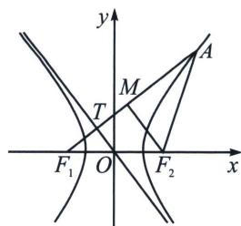

<!-- question-source:start -->
例7 (河南省H20联盟2025届高三下学期4月联考T14)已知 $\triangle AF_{1}F_{2}$ 的顶点 $F_{1}$ , $F_{2}$ 分别为双曲线C: $\frac{x^{2}}{a^{2}}-\frac{y^{2}}{b^{2}}=1(a>0, b>0)$ 的左、右焦点, 点A在C的右支上, 且 $AF_{1}$ 与C的一条渐近线垂直, 记C的离心率为e, 若 $\tan\angle F_{1}AF_{2}=\frac{\sqrt{3}}{3}$ , 则 $e^{2}=$ \_\_\_\_.

<!-- question-source:end -->

![[高中/总复习/专题/2026版高中《mst老唐说题》圆锥曲线专题（数学）/上册/第02章_离心率/第二节_几何性质下的渐近线模型/一_焦点到渐近线距离构造特征三角形/例题/answers/Q00048433A1.md]]
