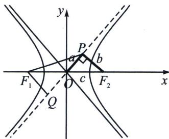

> [!faq]- 《圆锥曲线专题(上册)》例题解析
>
> > [!success]- **【答案】** C
>
> > [!note]- **【分析】**
> > 本题未单列分析。
>
> > [!note]- **【解析】**
> > 解析 双曲线 $\frac{x^2}{a^2} -\frac{y^2}{b^2} = 1(a > 0,b > 0)$ 的一条渐近线方程为 $y = \frac{b}{a} x$ ，所以点 $F_{2}$ 到渐近线的距离 $|PF_2| = b$ ，所以 $|OP| = a$ ， $\cos \angle PF_2O = \frac{b}{c}$ ，因为 $|PF_1| = \sqrt{6}|OP|$ ，所以 $|PF_1| = \sqrt{6} a,$
> > 解法一(余弦定理): 在三角形 $F_{1}PF_{2}$ 中, 由余弦定理得 $\left|PF_{1}\right|^{2} = \left|PF_{2}\right|^{2} + \left|F_{1}F_{2}\right|^{2} - 2\left|PF_{2}\right|\cdot$ $\left|F_{1}F_{2}\right|\cos \angle PF_{2}O,$
> > 所以 $6a^{2} = b^{2} + 4c^{2} - 2 \times b \times 2c \times \frac{b}{c} = 4c^{2} - 3(c^{2} - a^{2})$ ，即 $3a^{2} = c^{2}$ ，即 $\sqrt{3}a = c$ ，所以 $e = \frac{c}{a} = \sqrt{3}$ ，故选 C.
> > 解法二(极化恒等式): 由 $OP$ 为 $\triangle F_{1}PF_{2}$ 的中线, 故 $\frac{1}{2} (|PF_{1}|^{2} + |PF_{2}|^{2}) = |OP|^{2} + |OF_{2}|^{2} \Rightarrow 6a^{2} + b^{2} = 2a^{2} + 2c^{2}$ , 即 $3a^{2} = c^{2}$ , 即 $\sqrt{3} a = c$ , 所以 $e = \frac{c}{a} = \sqrt{3}$ ,
> > 
> > 解法三: (对称化构造), 如图, 过 $F_{1}$ 作 $F_{1}Q \perp OP$ 交其延长线于 $Q$ , 所以 $|F_{1}Q| = b$ , $|PQ| = 2a$ , 所以 $|PF_{1}|^{2} - |PQ|^{2} = |F_{1}Q|^{2}$ , 即 $b^{2} = 2a^{2}$ , 所以 $e = \frac{c}{a} = \sqrt{3}$ ,
> >
> > 故选 **C**.
