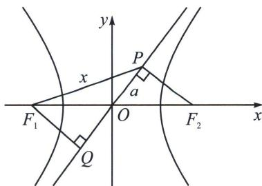
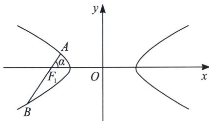
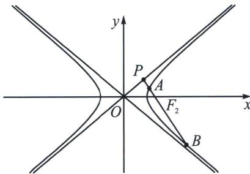
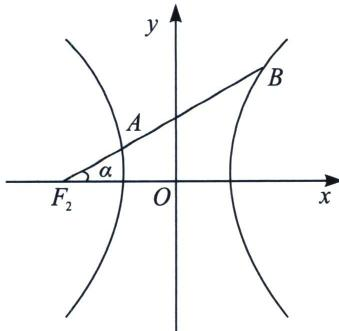
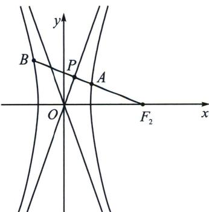

> [!faq]- 《圆锥曲线专题(上册)》例题解析
>
> > [!success]- **【答案】** D
>
> > [!note]- **【分析】**
> > 本题未单列分析。
>
> > [!note]- **【解析】**
> > 解析 解法一(坐标语言): 因为过 $F_{2}(c,0)$ 作一条渐近线 $y = \frac{b}{a} x$ 的垂线, 垂足为 $P$ , 则 $|PF_{2}| = b = 2$ , 联立 $\left\{ \begin{array}{l} y = \frac{b}{a} x \\ y = -\frac{a}{b} (x - c) \end{array} \right.$ , 可得 $x = \frac{a^{2}}{c}$ , $y = \frac{ab}{c}$ , 即 $P\left(\frac{a^{2}}{c}, \frac{ab}{c}\right)$ , 因为直线 $PF_{1}$ 的斜率 $\frac{\frac{ab}{c}}{\frac{a^{2}}{c} + c} = \frac{\sqrt{2}}{4}$ , 整理得 $\sqrt{2}(a^{2} + c^{2}) = 4ab$ ②, ①②联立得, $a = \sqrt{2}$ , $b = 2$ , 故双曲线方程为 $\frac{x^{2}}{2} - \frac{y^{2}}{4} = 1$ .
> > 
> > 解法二(对称化构造): 如图, 过 $F_{1}$ 作 $F_{1}Q \perp OP$ 交其延长线于 $Q$ , 所以 $|PF_{2}| = |F_{1}Q| = b = 2$ , $|PQ| = 2a$ , 由于直线 $PF_{1}$ 的斜率为 $\frac{\sqrt{2}}{4}$ , 则 $\tan \alpha = \frac{\sqrt{2}}{4}$ , 令 $\angle OF_{1}Q = \beta$ , $\tan \beta = \frac{a}{2}$ , 且 $\tan (\alpha + \beta) = \frac{2a}{2} = a = \frac{\tan \alpha + \tan \beta}{1 - \tan \alpha \tan \beta}$ , 所以 $a = \frac{\frac{\sqrt{2}}{4} + \frac{a}{2}}{1 - \frac{\sqrt{2}a}{8}}$ , $a = \sqrt{2}$ , 故选 D.
> > ## 2. 与焦长综合的渐近线三角形
> > A、B 是双曲线 $\frac{x^{2}}{a^{2}} - \frac{y^{2}}{b^{2}} = 1$ 左支上两点， $F_{1}$ 是左焦点， $\angle AF_{1}O$ 为 $\alpha$ ，AB 过 $F_{1}$ ，c 是双曲线半焦距，如左图，则 $\left|AF_{1}\right| = \frac{b^{2}}{a + c\cos\alpha}$ ①； $\left|BF_{1}\right| = \frac{b^{2}}{a - c\cos\alpha}$ ②；
> > 
> > 
> > 由于 $\cos \alpha = \frac{b}{c}$ ，如右图所示， $|AF_2| = \frac{b^2}{a + c\cos\alpha} = \frac{b^2}{a + b}$ ， $|BF_2| = \frac{b^2}{a - c\cos\alpha} = \frac{b^2}{a - b}$ ；
> > A 是双曲线 $\frac{x^{2}}{a^{2}} - \frac{y^{2}}{b^{2}} = 1$ 左支上一点，B 是双曲线右支上一点， $F_{1}$ 是左焦点， $\angle AF_{1}O$ 为 $\alpha$ ，AB 过 $F_{1}$ ，c 是双曲线半焦距，如图，由于交两支时，有 $|k| < \frac{b}{a}$ ，平方得： $\tan^{2}\alpha < \frac{b^{2}}{a^{2}}$ ，即 $\cos\alpha > \frac{a}{c}$ ，故 $a - c\cos\alpha < 0$ $|AF_{1}| = \frac{b^{2}}{a + c\cos\alpha}$ ①； $|BF_{1}| = \frac{b^{2}}{c\cos\alpha - a}$ ②；（根据长减短加判断符号）
> > 
> > 
> > 由于 $\cos \alpha = \frac{b}{c}$ ，如右图所示， $|AF_2| = \frac{b^2}{a + c\cos\alpha} = \frac{b^2}{a + b}$ ， $|BF_2| = \frac{b^2}{c\cos\alpha - a} = \frac{b^2}{b - a}$ ；
