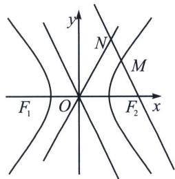

> [!faq]- 《圆锥曲线专题(上册)》例题解析
>
> > [!success]- **【答案】** AC
>
> > [!note]- **【分析】**
> > 本题未单列分析。
>
> > [!note]- **【解析】**
> > 解析 由条件知 $\angle NOF_{2} = \angle NF_{2}O$ ， $\tan \angle NOF_{2} = \frac{b}{a}$ ， $\cos \angle NF_{2}O = \frac{a}{c}$ ， $\sin \angle NF_{2}O = \frac{b}{c}$
> > 
> > A 选项： $NF_{1} \perp NF_{2}$ ，则 $|ON| = |NF_{2}| = \frac{1}{2} |F_{1}F_{2}| = c$ ，所以 $\frac{b}{a} = \sqrt{3}$ ， $e = \frac{c}{a} = 2$ ，A 正确；
> > B 选项：由 $MF_{1} \perp MF_{2}$ ，则有 $|MF_{2}| = 2c\cos\angle NF_{2}O = 2a$ ， $|MF_{1}| = 2c\sin\angle NF_{2}O = 2b$ ，
> > 又 $|MF_{1}| - |MF_{2}| = 2a$ ，所以 $2b - 2a = 2a, b = 2a, c^{2} = 5a^{2}$ ，所以 $e = \sqrt{5}$ ，B 错误；
> > C 选项：由 $\left|NF_{2}\right|=2\left|MF_{2}\right|$ ， $\left|MF_{2}\right|=\frac{b^{2}}{a+c\cos\alpha}=\frac{b^{2}}{2a}$ ， $\left|ON\right|=\left|NF_{2}\right|=\frac{c}{2\cos\alpha}=\frac{c^{2}}{2a}$ ，所以 $c^{2}=2b^{2}$ ，
> > 所以 $e=\sqrt{2}$ ，C 正确；
> > D选项： $|MF_{2}| = \frac{c^{2} - a^{2}}{2a}$ ， $|MF_{1}| = |MF_{2}| + 2a = \frac{3a^{2} + c^{2}}{2a}$ ，由 $|MF_{1}| \geqslant 5|MF_{2}|$ ，即 $\frac{3a^2 + c^2}{2a} \geqslant 5 \cdot \frac{c^2 - a^2}{2a}$ ，解得 $2a^{2} \geqslant c^{2}$ ，所以 $1 < e \leqslant \sqrt{2}$ ，D错误．故选AC.
> > ## 4. 小圆中位线与 $2a$ 的数据构造
