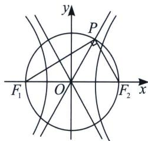
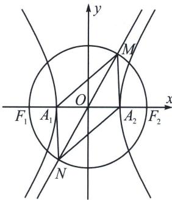

## 三、大圆与渐近线交点构造坐标特征三角形

这里通常是双曲线的坐标特征三角形，需要借助辅助大圆.

如图，以 $F_{1}F_{2}$ 为直径的圆与双曲线 $\frac{x^2}{a^2} -\frac{y^2}{b^2} = 1(a > 0,b > 0)$ 的渐近线在第一象限内的交点坐标为 $P(a,$ $b)$ ，不过，很多时候，题目会以“点 $P$ 在渐近线上，且 $PF_{1}\bot PF_{2}$ ”的形式给出条件.

证明：渐近线的方程为 $y=\frac{b}{a}x$ ，设 $P(am, bm)(m>0)$ ，则 $OP^{2}=a^{2}m^{2}+b^{2}m^{2}=c^{2}$ ，即 m=1，即 $P(a, b)$ 例⑪（2025 新课标Ⅱ卷第 11 题多选）对于双曲线 C: $\frac{x^{2}}{a^{2}}-\frac{y^{2}}{b^{2}}=1(a>0, b>0)$ ，左、右焦点为 $F_{1}$ 、 $F_{2}$ ，左、右顶点为 $A_{1}$ 、 $A_{2}$ ，以 $F_{1}F_{2}$ 为直径的圆与 C 的一条渐近线交于 M、N，且 $\angle NA_{1}M=\frac{5\pi}{6}$ ，下列说法正确的是

A. $\angle A_{1}MA_{2}=\frac{\pi}{6}$ B. $|MA_{1}|=2|MA_{2}|$ C. C 的离心率为 $\sqrt{13}$ D. 当 $a=\sqrt{2}$ 时，四边形 $NA_{1}MA_{2}$ 的面积为 $8\sqrt{3}$

解析 设斜率为正的渐近线 $l_{MN}$ ： $y=\frac{b}{a}x$ ，又MO=r=c，则易知 $M(a,b)$ ，又 $A_{1}(-a,0)$ ， $A_{2}(a,0)$ 则 $MA_{2}\perp A_{1}A_{2}$ ，如图：

$\angle A_{1}MA_{2}=\pi-\angle NA_{1}M=\frac{\pi}{6},\quad A$ 正确；

则在 $\mathrm{Rt}\Delta A_1MA_2$ 中， $\angle MA_{1}A_{2} = 60^{\circ}$ ，故 $\sqrt{3}|MA_1| = 2|MA_2|$ ，B错误；

因为 $\tan \angle A_{1}MA_{2} = \frac{2a}{b} = \frac{\sqrt{3}}{3}$ ，则 $e = \frac{c}{a} = \sqrt{1 + \frac{b^2}{a^2}} = \sqrt{13}$ ，C正确；

当 $a = \sqrt{2}$ 时， $S_{NA_1MA_2} = 2 \times \frac{1}{2} |MA_1| \cdot |MA_2| = 2ab = 8\sqrt{3}$ ，D正确，故本题选ACD.

![[高中/总复习/专题/2026版高中《mst老唐说题》圆锥曲线专题（数学）/上册/第02章_离心率/第二节_几何性质下的渐近线模型/三_大圆与渐近线交点构造坐标特征三角形/例题/Q00048437.md]]
![[高中/总复习/专题/2026版高中《mst老唐说题》圆锥曲线专题（数学）/上册/第02章_离心率/第二节_几何性质下的渐近线模型/三_大圆与渐近线交点构造坐标特征三角形/例题/Q00048438.md]]
![[高中/总复习/专题/2026版高中《mst老唐说题》圆锥曲线专题（数学）/上册/第02章_离心率/第二节_几何性质下的渐近线模型/三_大圆与渐近线交点构造坐标特征三角形/例题/Q00048439.md]]
![[高中/总复习/专题/2026版高中《mst老唐说题》圆锥曲线专题（数学）/上册/第02章_离心率/第二节_几何性质下的渐近线模型/三_大圆与渐近线交点构造坐标特征三角形/例题/Q00048440.md]]
![[高中/总复习/专题/2026版高中《mst老唐说题》圆锥曲线专题（数学）/上册/第02章_离心率/第二节_几何性质下的渐近线模型/三_大圆与渐近线交点构造坐标特征三角形/例题/Q00048441.md]]
![[高中/总复习/专题/2026版高中《mst老唐说题》圆锥曲线专题（数学）/上册/第02章_离心率/第二节_几何性质下的渐近线模型/三_大圆与渐近线交点构造坐标特征三角形/例题/Q00048442.md]]
