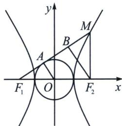

<!-- question-source:start -->
例17 (2024·多选·江西期末)已知 O 为坐标原点， $F_{1}$ ， $F_{2}$ 分别为双曲线 $C: \frac{x^{2}}{a^{2}} - \frac{y^{2}}{b^{2}} = 1 (a > 0, b > 0)$ 的左、右焦点，点 M 为双曲线右支上一点，设 $\angle F_{1}MF_{2} = \theta$ ，过 M 作两渐近线的垂线，垂足分别为 P, Q，则下列说法正确的是
A. $|F_{2}M|$ 的最小值为 c - a
B. $|MP| \cdot |MQ|$ 为定值
C. 若当 $\theta = \frac{\pi}{2}$ 时 $\triangle OMF_{2}$ 恰好为等边三角形，则双曲线 C 的离心率为 $2\sqrt{3} - 2$ D. 当 $\theta = \frac{\pi}{3}$ 时若直线 $F_{1}M$ 与圆 $x^{2} + y^{2} = a^{2}$ 相切，则双曲线 C 的离心率为 $\frac{\sqrt{21 + 6\sqrt{3}}}{3}$

## 解析 对于 A，因为 $F_{2}$ 是双曲线 C 的右焦点，点 M 为双曲线右支上一点，所以由双曲线性质知线段 $\left|F_{2}M\right|$ 长度的最小值为 c-a，故 A 正确；

对于 B，设 $M(x_{0}, y_{0})$ ，两渐近线方程分别为 $bx + ay = 0, bx - ay = 0$ ，所以 $|MP| \cdot |MQ| = \frac{|bx_{0} - ay_{0}|}{\sqrt{b^{2} + a^{2}}} \cdot \frac{|bx_{0} + ay_{0}|}{\sqrt{b^{2} + a^{2}}} = \frac{|b^{2}x_{0}^{2} - a^{2}y_{0}^{2}|}{c^{2}}$ ，又因为 $M(x_{0}, y_{0})$ 满足 $\frac{x_{0}^{2}}{a^{2}} - \frac{y_{0}^{2}}{b^{2}} = 1$ ，可得 $b^{2}x_{0}^{2} - a^{2}y_{0}^{2} = a^{2}b^{2}$ ，所以 $|MP| \cdot |MQ| = \frac{|b^{2}x_{0}^{2} - a^{2}y_{0}^{2}|}{c^{2}} = \frac{b^{2}a^{2}}{c^{2}}$ ，故 B 正确；

对于 C，因为 $\theta=\frac{\pi}{2}$ ，所以 $F_{1}M\perp F_{2}M$ ，而 $\triangle OMF_{2}(O$ 为坐标原点 $)$ 恰好为等边三角形，因此由 $\left|F_{1}F_{2}\right|=2c$ ，知 $\left|F_{1}M\right|=\sqrt{3}c$ ， $\left|F_{2}M\right|=c$ ，所以 $\left|F_{1}M\right|-\left|F_{2}M\right|=\sqrt{3}c-c=2a$ ，所以 $\frac{c}{a}=\frac{2}{\sqrt{3}-1}=\sqrt{3}+1$ ，即双曲线 C 的离心率 $e=\sqrt{3}+1$ ，故 C 不正确；

对于 D，如图，设直线 $F_{1}M$ 与圆 $x^{2}+y^{2}=a^{2}$ 相切于点 A，连接 OA，则 $OA \perp F_{1}M$ ，且 $|OA|=a$ 。作 $F_{2}B \perp F_{1}M$ 于点 B，则 $|F_{2}B|=2a$ ，又因为 $\angle F_{1}MF_{2}=\frac{\pi}{3}$ ，所以 $|BM|=\frac{2\sqrt{3}}{3}a$ ， $|F_{2}M|=\frac{4\sqrt{3}}{3}a$ ，

因此在 $\mathrm{Rt}\triangle F_1BF_2$ 中， $|F_{1}B| = \sqrt{|F_{1}F_{2}|^{2} - |F_{2}B|^{2}} = \sqrt{4c^{2} - 4a^{2}} = 2b$ ，又点 $M$ 在双曲线的右支上，

所以 $|F_1M| - |F_2M| = \frac{2\sqrt{3}}{3} a + 2b - \frac{4\sqrt{3}}{3} a = 2a$ ，整理得 $b = a + \frac{\sqrt{3}}{3} a$ ，两边平方得 $b^2 = \left(1 + \frac{1}{3} + \frac{2\sqrt{3}}{3}\right)a^2$ ，即 $c^2 - a^2 = \left(1 + \frac{1}{3} + \frac{2\sqrt{3}}{3}\right)a^2$ ，解得 $e = \frac{\sqrt{21 + 6\sqrt{3}}}{3}$ ，故D正确。故选ABD.
<!-- question-source:end -->
