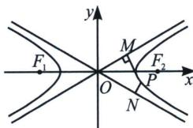
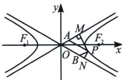

> [!faq]- 《圆锥曲线专题(上册)》例题解析
>
> > [!success]- **【答案】** A
>
> > [!note]- **【分析】**
> > 本题未单列分析。
>
> > [!note]- **【解析】**
> > 解析 根据双曲线特征三角形可知 $P(a, -b)$ , 又 $F_{1}(-c, 0)$ , 设 $Q(m, n)$ , $\overrightarrow{PQ} = (m - a, n + b)$ , $\overrightarrow{QF_{1}} = (-c - m, -n)$ , 由 $2\overrightarrow{F_{1}Q} = \overrightarrow{QP}$ , 得 $(m - a, n + b) = (-2c - 2m, -2n)$ 因为 $\left\{ \begin{array}{l} m - a = -2c - 2m \\ n + b = -2n \end{array} \right.$ , 解得 $Q\left( \frac{a - 2c}{3}, -\frac{b}{3} \right)$ , 代入双曲线方程, 可得 $\frac{(a - 2c)^{2}}{9a^{2}} - \frac{b^{2}}{9b^{2}} = 1$ , 解得 $e = \frac{\sqrt{10} + 1}{2}$ , 故选 A. 四、渐近线隐藏的面积和向量积定值
> > 
> > 
> > - **①**：双曲线 $C: \frac{x^{2}}{a^{2}} - \frac{y^{2}}{b^{2}} = 1$ 上的任意点 $P$ 到双曲线 $C$ 的两条渐近线的距离的乘积是一个常数 $\frac{a^{2}b^{2}}{c^{2}}$ (左图);证明: 设 $P(x_{1}, y_{1})$ 是双曲线上任意一点, 该双曲线的两条渐近线方程分别是 $bx - ay = 0$ 和 $bx + ay = 0$ , 点 $P(x_{1}, y_{1})$ 到两条渐近线的距离分别是 $\frac{|bx_{1} - ay_{1}|}{\sqrt{a^{2} + b^{2}}}$ , $\frac{|bx_{1} + ay_{1}|}{\sqrt{a^{2} + b^{2}}}$ 乘积 $\frac{|bx_{1} + ay_{1}|}{\sqrt{a^{2} + b^{2}}} \cdot \frac{|bx_{1} - ay_{1}|}{\sqrt{a^{2} + b^{2}}} = \frac{b^{2}x_{1}^{2} - a^{2}y_{1}^{2}}{c^{2}} = \frac{a^{2}b^{2}}{c^{2}}$
