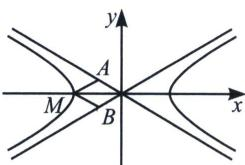
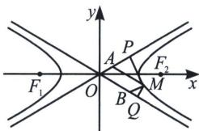

> [!faq]- 《圆锥曲线专题(上册)》例题解析
>
> > [!success]- **【答案】** D
>
> > [!note]- **【解析】**
> > 解析 解法一(特殊值法): 因为 $M$ 为双曲线 $D: \frac{x^{2}}{a^{2}} - \frac{y^{2}}{16} = 1 (a > 0)$ 上任意一点, 所以不妨设 $M(-a, 0)$ , 双曲线的两条渐近线方程为 $y = \pm \frac{4}{a} x$ , 过 $M$ 与两条渐近线平行的直线方程为 $y = \pm \frac{4}{a} (x + a)$ , 联立 $\left\{ \begin{array}{l} y = -\frac{4}{a} x \\ y = \frac{4}{a} (x + a) \end{array} \right.$ , 解得 $A \left( -\frac{a}{2}, 2 \right)$ , 同理可得 $B \left( -\frac{a}{2}, -2 \right)$ , 所以 $S_{\triangle ABM} = \frac{1}{2} \cdot \left( \frac{1}{2} \times a \times 4 \right) = a = 4$ , 又 $b = 4$ , 所以 $c = \sqrt{4^2 + 4^2} = 4\sqrt{2}$ , 得 $e = \frac{c}{a} = \sqrt{2}$ , 故选 D.
> >
> > 
> >
> > 
> >
> > 解法二(通解法): 作 $MP \perp l_1$ 于 $P$ , $MQ \perp l_2$ 于 $Q$ , 设 $M(m, n)$ , 则 $\frac{m^2}{a^2} - \frac{n^2}{b^2} = 1$ , 故 $|MP| \cdot |MQ| = \frac{|bm + an|}{\sqrt{a^2 + b^2}} \cdot \frac{|bm - an|}{\sqrt{a^2 + b^2}} = \frac{b^2m^2 - a^2n^2}{c^2} = \frac{a^2b^2}{c^2}$ , $\angle MAP = \angle MBQ = \angle AOB = 2\alpha$ , 其中 $\tan \alpha = \frac{b}{a}$ , 则 $\sin 2\alpha = 2\sin \alpha \cos \alpha = \frac{2ab}{c^2}$ , $S_{\text{四边形}AOBM} = \frac{|PM||QM|}{\sin 2\alpha} = \frac{a^2b^2}{c^2} \frac{c^2}{2ab} = \frac{ab}{2}$ , 故 $S_{\triangle ABM} = \frac{1}{2} S_{\text{四边形}OABM} = \frac{ab}{4} = a = 4$ , 所以 $c = \sqrt{4^2 + 4^2} = 4\sqrt{2}$ , 得 $e = \frac{c}{a} = \sqrt{2}$ ,
> >
> > 故选 **D**.
