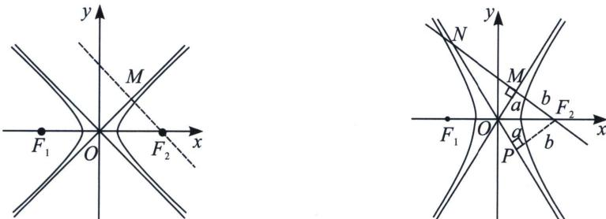
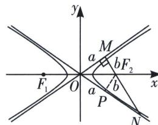

## 二、渐近线相似三角形比值与离心率

①如左图所示, 当离心率 $e = \sqrt{2}$ 时, 过焦点作渐近线垂线, 则不会形成直角三角形;

②如右图所示, 当离心率 $e > \sqrt{2}$ 时, 过焦点 $F_{2}$ 作渐近线 $l_{1}$ 垂线 $MN(k_{MN} < 0)$ , 会交 $l_{2}$ 于第二象限点 $N$ , 令 $\overrightarrow{NM} = \lambda \overrightarrow{MF_{2}}$ , 则双曲线离心率为 $e = \sqrt{2} \cdot \sqrt{\frac{\lambda + 1}{\lambda}}$ ;

证明：作 $F_{2}P \perp l_{2}$ 于 $P$ ，易知 $|OM| = |OP| = a$ ， $|F_{2}M| = |F_{2}P| = b$ ， $\triangle OMN \sim \triangle F_{2}PN$ ，则 $\frac{|ON|}{|F_{2}N|} = \frac{|OM|}{|F_{2}P|}$ ，可知： $|ON| = (1 + \lambda)a$ ，根据勾股定理 $|OM|^2 + |MN|^2 = |ON|^2$ ，即 $\frac{b^2}{a^2} = \frac{\lambda + 2}{\lambda}$ ，故 $e^2 = 1 + \frac{b^2}{a^2} =$

$\frac{2\lambda+2}{\lambda}$ ，所以 $e=\sqrt{2}\cdot\sqrt{\frac{\lambda+1}{\lambda}}$ .

③如图所示, 当离心率 $e < \sqrt{2}$ 时, 过焦点 $F_{2}$ 作渐近线 $l_{1}$ 垂线 $MN(k_{MN} < 0)$ , 会交 $l_{2}$ 于第四象限点 $N$ , 令 $\overrightarrow{NF_{2}} = \lambda \overrightarrow{F_{2}M}$ , 则双曲线离心率为 $e = \sqrt{2} \cdot \sqrt{\frac{\lambda}{\lambda + 1}}$ ;

证明：作 $F_{2}P \perp l_{2}$ 于 $P$ ，易知 $|OM| = |OP| = a$ ， $|F_{2}M| = |F_{2}P| = b$ ， $\triangle OMN \sim \triangle F_{2}PN$ ，则 $\frac{|ON|}{|F_{2}N|} = \frac{|OM|}{|F_{2}P|}$ ，可知： $|ON| = \lambda a$ ，根据勾股定理 $|OM|^2 + |MN|^2 = |ON|^2$ ，即 $\frac{b^2}{a^2} = \frac{\lambda - 1}{\lambda + 1}$ ，故 $e^2 = 1 + \frac{b^2}{a^2} = \frac{2\lambda}{\lambda + 1}$ ，所以 $e = \sqrt{2} \cdot \sqrt{\frac{\lambda}{\lambda + 1}}$ .

总结：一切源于直角三角形相似，需要作辅助线构造，其实结论很好理解记忆，就是 $e$ 与 $\sqrt{2}$ 比大小，大于 $\sqrt{2}$ 就是 $e = \sqrt{2}\sqrt{\frac{\lambda + 1}{\lambda}}$ ，小于 $\sqrt{2}$ 就是 $e = \sqrt{2} \cdot \sqrt{\frac{\lambda}{\lambda + 1}}$

![[高中/总复习/专题/2026版高中《mst老唐说题》圆锥曲线专题（数学）/上册/第02章_离心率/第二节_几何性质下的渐近线模型/二_渐近线相似三角形比值与离心率/例题/Q00048434.md]]
![[高中/总复习/专题/2026版高中《mst老唐说题》圆锥曲线专题（数学）/上册/第02章_离心率/第二节_几何性质下的渐近线模型/二_渐近线相似三角形比值与离心率/例题/Q00048435.md]]
![[高中/总复习/专题/2026版高中《mst老唐说题》圆锥曲线专题（数学）/上册/第02章_离心率/第二节_几何性质下的渐近线模型/二_渐近线相似三角形比值与离心率/例题/Q00048436.md]]
