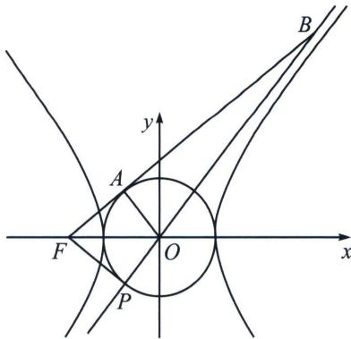

<!-- question-source:start -->
例9 (2024·化州市期中)过双曲线 $C: \frac{x^2}{a^2} - \frac{y^2}{b^2} = 1 (a > 0, b > 0)$ 的左焦点 $F$ 作圆 $x^2 + y^2 = a^2$ 的切线，

切点为 A，直线 FA 交直线 bx - ay = 0 于点 B。若 $\overrightarrow{BA} = 3\overrightarrow{AF}$ ，则双曲线 C 的离心率为 \_\_\_\_.

<!-- question-source:end -->

![[高中/总复习/专题/2026版高中《mst老唐说题》圆锥曲线专题（数学）/上册/第02章_离心率/第二节_几何性质下的渐近线模型/二_渐近线相似三角形比值与离心率/例题/answers/Q00048435A1.md]]
