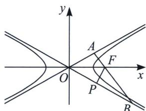
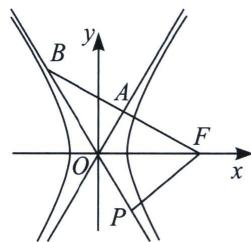

<!-- question-source:start -->
例10 (2022·上虞区期末)过双曲线 $\frac{x^{2}}{a^{2}} - \frac{y^{2}}{b^{2}} = 1 (a > 0, b > 0)$ 右焦点 $F$ 作双曲线一条渐近线的垂线，垂足为 $A$ ，与另一条渐近线交于点 $B$ ，若 $|AF| = \frac{1}{2} |FB|$ ，则双曲线 $C$ 的离心率为 ( )

A. $\frac{2\sqrt{3}}{3}$ 或 $\sqrt{3}$ B. 2 或 $\sqrt{3}$ C. $\sqrt{3}$ 或 $2\sqrt{3}$ D. 2 或 $\frac{2\sqrt{3}}{3}$

<!-- question-source:end -->

![[高中/总复习/专题/2026版高中《mst老唐说题》圆锥曲线专题（数学）/上册/第02章_离心率/第二节_几何性质下的渐近线模型/二_渐近线相似三角形比值与离心率/例题/answers/Q00048436A1.md]]
