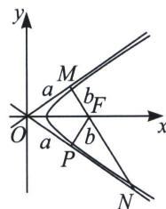

> [!faq]- 《圆锥曲线专题(上册)》例题解析
>
> > [!success]- **【答案】** B
>
> > [!note]- **【解析】**
> > 解析 双曲线 $C: \frac{x^2}{3} - y^2 = 1$ 的渐近线方程为： $y = \pm \frac{\sqrt{3}}{3} x$ ，渐近线的夹角为 $60^\circ$ .
> >
> > 解法一：不妨设过 $F(2,0)$ 的直线为 $y = -\sqrt{3}(x - 2)$ ，联立 $\left\{ \begin{array}{l} y = \frac{\sqrt{3}}{3} x \\ y = -\sqrt{3}(x - 2) \end{array} \right.$ ，解得 $M\left(\frac{3}{2}, \frac{\sqrt{3}}{2}\right)$ ，联立 $\left\{ \begin{array}{l} y = -\frac{\sqrt{3}}{3} x \\ y = -\sqrt{3}(x - 2) \end{array} \right.$ ，解得 $N(3, -\sqrt{3})$ ，则 $|MN| = \sqrt{\left(3 - \frac{3}{2}\right)^2 + \left(\sqrt{3} + \frac{\sqrt{3}}{2}\right)^2} = 3.$
> >
> > 解法二：因为 $e<\sqrt{2}$ ，如图所示，则 $\left|MF\right|=\left|PF\right|=1,\quad\left|FN\right|=2\left|PF\right|=2$ ，所以 $\left|MN\right|=3$ ，故选 B.
> >
> > 
