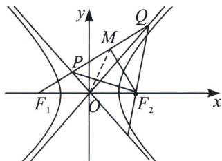
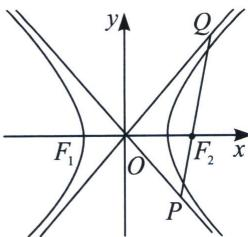
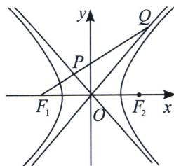

> [!faq]- 《圆锥曲线专题(上册)》例题解析
>
> > [!success]- **【答案】** 2
>
> > [!note]- **【解析】**
> > 解析 解法一(坐标语言): 设直线 $l$ 的方程为 $x = my - c$ , 联立 $\left\{ \begin{array}{l} x = my - c \\ y = -\frac{b}{2}x \end{array} \right.$ , 得 $\left\{ \begin{array}{l} x = \frac{-2c}{mb + 2} \\ y = \frac{bc}{mb + 2} \end{array} \right.$ , 即 $P$ $\left( \frac{-2c}{mb + 2}, \frac{bc}{mb + 2} \right)$ , 同理可得 $Q\left( \frac{2c}{mb - 2}, \frac{bc}{mb - 2} \right)$ , 则 $PQ$ 的中点 $M\left( \frac{4c}{b^2m^2 - 4}, \frac{b^2cm}{b^2m^2 - 4} \right)$ , 因为 $|F_2P| = |F_2Q|$ , 所以 $F_2M \perp PQ$ , 当 $m = 0$ 时, $PQ \perp x$ 轴, 此时 $P\left( -c, \frac{bc}{2} \right)$ , $Q\left( -c, -\frac{bc}{2} \right)$ , 又由 $|OP| = |OQ|$ , 得 $2|OP|^2 = |PQ|^2$ , 即 $2\left( c^2 + \frac{b^2c^2}{4} \right) = b^2c^2$ , 整理得 $b = 2$ , 这与 $b > 2$ 矛盾, 故 $m \neq 0$ ; 当 $m \neq 0$ 时, 由 $k_{F_2M} \cdot k_{PQ} = -1$ , 得 $\frac{\frac{b^2cm}{b^2m^2 - 4}}{\frac{4c}{b^2m^2 - 4} - c} \cdot \frac{1}{m} = -1$ , 即 $m^2 = \frac{8 + b^2}{b^2}$ , 又因为 $2|OP| \cdot |OQ| = |PQ|^2$ , 所以 $2\sqrt{\left( \frac{-2c}{bm + 2} \right)^2 + \left( \frac{bc}{bm + 2} \right)^2} \cdot \sqrt{\left( \frac{2c}{bm - 2} \right)^2 + \left( \frac{bc}{bm - 2} \right)^2} = \left( \frac{2c}{bm - 2} + \frac{2c}{bm + 2} \right)^2 + \left( \frac{bc}{bm - 2} - \frac{bc}{bm + 2} \right)^2$ , 把 $m^2 = \frac{8 + b^2}{b^2}$ 代入并化简整理, 得 $c^2 = \frac{8b^2\left( \frac{8 + b^2}{b^2} + 1 \right)}{\left| b^2 \cdot \frac{8 + b^2}{b^2} - 4 \right|} = \frac{16(4 + b^2)}{|b^2 + 4|} = 16$ , 即 $c = 4$ , 所以双曲线的离心率 $e = \frac{c}{a} = 2$ .
> >
> > 
> >
> > 解法二(长度语言): 令 $|PF_1| = m_1$ , $|QF_1| = m_2$ , $\angle PF_1F_2 = \theta$ , 则 $\frac{m_1\sin\theta}{c - m_1\cos\theta} = \frac{m_2\sin\theta}{m_2\cos\theta - c} = \frac{b}{a} = \tan\alpha$ , 所以 $\left\{ \begin{array}{l} m_1 = \frac{bc}{a\sin\theta + b\cos\theta} \\ m_2 = \frac{bc}{-a\sin\theta + b\cos\theta} \end{array} \right.$ , $|PQ| = m_2 - m_1 = \frac{2abc\sin\theta}{c^2\cos^2\theta - a^2}$ , $|MF_1| = \frac{m_1 + m_2}{2} = \frac{b^2cc\cos\theta}{c^2\cos^2\theta - a^2} = 2cc\cos\theta$ ，所以 $b^2 = 2(c^2\cos^2\theta - 4)$ ①; 且 $\sin^2\theta = \frac{b^2}{2c^2}$ ②, 由于 $2|OP| \cdot |OQ| = |PQ|^2$ ，根据极化恒等式， $|OP| \cdot |OQ| = \frac{\overrightarrow{OP} \cdot \overrightarrow{OQ}}{\cos\angle POQ} = \frac{|OM|^2 - \frac{|PQ|^2}{4}}{\sin^2\alpha - \cos^2\alpha} = \frac{c^2 - \frac{|PQ|^2}{4}}{\frac{b^2 - 1}{a^2}} = \frac{|PQ|^2}{2}$ , 所以 $\left(\frac{m_2 - m_1}{2}\right)^2 = \frac{4b^2c^2\sin^2\theta}{(c^2\cos^2\theta - 4)^2} = 8 = \frac{c^4}{3c^2 - 16}$ , $c^2 =$
> >
> > 16 或 $c^{2}=8$ (此时 b=2 矛盾)，双曲线的离心率 e=2。故答案为 2.
> >
> > 注意 双曲线两条渐近线是退化的二次曲线来理解，那么两条渐近线之间也有类似于焦长公式的计算公式，我们在这里给予总结，数形结合是很好推导的，令 $\theta$ 为焦弦与 $x$ 轴夹角.
> >
> > 
> >
> > 
> >
> > (1) $PQ$ 交双曲线一支时， $\frac{|QF_2|\sin\theta}{|QF_2|\cos\theta + c} = \frac{b}{a}$ ，所以 $|QF_2| = \frac{bc}{a\sin\theta - b\cos\theta}$ ，同理 $|PF_2| = \frac{bc}{a\sin\theta + b\cos\theta}$ (2)参考例18， $PQ$ 交双曲线两支时，可得： $\left\{ \begin{array}{l} |PF_1| = \frac{bc}{a\sin\theta + b\cos\theta} \\ |QF_1| = \frac{bc}{-a\sin\theta + b\cos\theta} \end{array} \right.$ ，区别仅仅是分母，考试时候可以直接推导，不需要强行记忆。
