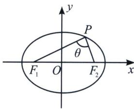
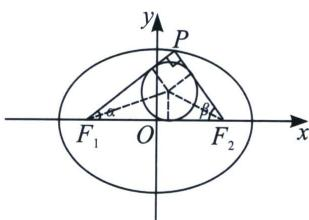
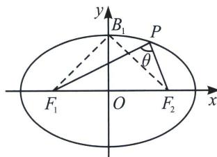

## 一、椭圆焦点三角形的性质

椭圆 $\frac{x^2}{a^2} +\frac{y^2}{b^2} = 1(a > b > 0)$ 焦点为 $F_{1}$ ， $F_{2}$ ， $P$ 为椭圆上的点， $\angle F_1PF_2 = \theta$ ，如图1，则 $S_{\triangle F_1PF_2} = b^2\cdot \frac{\sin\theta}{1 + \cos\theta} = b^2\tan \frac{\theta}{2}$ （灵动椭圆焦点三角形面积公式）

  
图1

证明：设 $|PF_{1}| = m, |PF_{2}| = n$

$\left\{ \begin{array}{l} m + n = 2a① \\ (2c)^2 = m^2 + n^2 - 2mn\cos\theta② \\ S_{\triangle F_1PF_2} = \frac{1}{2}mn\sin\theta③ \end{array} \right.$ ① $^{2}$ - ②: $mn = \frac{2b^{2}}{1 + \cos\theta}$ 所以 $S_{\triangle F_1PF_2} = b^{2} \cdot \frac{\sin\theta}{1 + \cos\theta} = b^{2} \cdot \frac{2\sin\frac{\theta}{2}\cos\frac{\theta}{2}}{2\cos^{2}\frac{\theta}{2}} =$

$$
b ^ {2} \tan \frac {\theta}{2}
$$

注意 焦点三角形面积，本质来自于解三角形部分， $S=\frac{1}{4}\left[(a+b)^{2}-c^{2}\right]\frac{\sin C}{1+\cos C}=\frac{1}{4}\left[(a+b)^{2}-c^{2}\right]\tan\frac{C}{2}$

  
图2

第一类：面积带动角度与坐标转化：（注意： $r$ 为内切圆半径）

(1)直角三角等面积法：如图2，当 $PF_{1}\perp PF_{2}$ 时，有 $S_{\triangle F_{1}PF_{2}}=b^{2}=\frac{2c|y_{p}|}{2}\Rightarrow|y_{p}|=\frac{b^{2}}{c}$ ;

$$
S _ {\triangle F _ {1} P F _ {2}} = b ^ {2} = \frac {m n}{2} \Rightarrow m n = 2 b ^ {2}; r = a - c,
$$

(2)任意角度的等面积法： $S_{\triangle F_{1}PF_{2}}=c|y_{p}|=b^{2}\tan\frac{\theta}{2}=\frac{1}{2}\overrightarrow{PF_{1}}\cdot\overrightarrow{PF_{2}}\tan\theta=(a+c)r.$

(3)直角顶点的讨论: 当 $S_{\triangle F_1PF_2} = b^2 \tan \frac{\theta}{2} = bc$ 时, $\theta$ 取得最大值, 若 $\theta > 90^\circ$ , 则 $\frac{\theta}{2} > 45^\circ$ , $\tan \frac{\theta}{2} = \frac{c}{b} > 1$ ; 同理, 若 $\theta = 90^\circ$ , 则 $\frac{\theta}{2} = 45^\circ$ , $\tan \frac{\theta}{2} = \frac{c}{b} = 1$ ; 若 $\theta < 90^\circ$ , 则 $\frac{\theta}{2} < 45^\circ$ , $\tan \frac{\theta}{2} = \frac{c}{b} < 1$ . 在分析直角顶点个数时, 当 $c > b$ 时, $PF_1 \perp PF_2$ 有四个点 $P$ 存在; 当 $c = b$ 时, $PF_1 \perp PF_2$ 有两个点 $P$ 存在; 当 $c < b$ 时, $PF_1 \perp PF_2$ 无点 $P$ 存在. (注意: $PF_1 \perp PF_2$ 与 Rt $\triangle PF_1F_2$ 的区别)

## (4)短轴端点处 $\angle F_{1}PF_{2}$ 张角最大

已知椭圆 $\frac{x^2}{a^2} +\frac{y^2}{b^2} = 1(a > b > 0)$ 的左、右两焦点分别为 $F_{1}$ 、 $F_{2}$ ， $P$ 是椭圆上一动点，在焦点三角形 $PF_{1}F_{2}$ 中，若 $\angle F_1PF_2$ 最大，则点 $P$ 为椭圆短轴的端点.

证明： $S_{\triangle PF_1F_2} = b^2 \tan \frac{\angle F_1PF_2}{2} = c \left| y_P \right|$ ，故当 $y_P$ 取得最大值 $b$ 时，即当点 $P$ 位于短轴端点时， $\angle F_1PF_2$ 取得最大值。

(5)已知椭圆 $\frac{x^2}{a^2} +\frac{y^2}{b^2} = 1(a > b > 0)$ 的左、右两焦点分别为 $F_{1}$ 、 $F_{2}$ ，若椭圆上存在一点 $P$ ，使得 $\angle F_1PF_2$ $= \theta$ ，则椭圆离心率 $e\in \left[\sin \frac{\theta}{2},1\right)$

证明：如图，设 $B_{1}$ 为椭圆的短轴顶点，假设椭圆上存在一点 $P$ ，使得 $\angle F_{1}PF_{2} = \theta$ ，则必有 $\angle F_{1}B_{1}F_{2} \geqslant \theta$ ，又 $e = \sin \frac{\angle F_{1}B_{1}F_{2}}{2}$ ，由于 $\frac{\theta}{2} \leqslant \frac{\angle F_{1}B_{1}F_{2}}{2} < \frac{\pi}{2}$ ，故 $e \in \left[\sin \frac{\theta}{2}, 1\right)$ .

![[高中/总复习/专题/2026版高中《mst老唐说题》圆锥曲线专题（数学）/上册/第03章_几何视角下的焦点三角形/第一节_角度语言与坐标语言下的焦点三角形/一_椭圆焦点三角形的性质/例题/Q00048466.md]]
![[高中/总复习/专题/2026版高中《mst老唐说题》圆锥曲线专题（数学）/上册/第03章_几何视角下的焦点三角形/第一节_角度语言与坐标语言下的焦点三角形/一_椭圆焦点三角形的性质/例题/Q00048467.md]]
![[高中/总复习/专题/2026版高中《mst老唐说题》圆锥曲线专题（数学）/上册/第03章_几何视角下的焦点三角形/第一节_角度语言与坐标语言下的焦点三角形/一_椭圆焦点三角形的性质/例题/Q00052979.md]]
![[高中/总复习/专题/2026版高中《mst老唐说题》圆锥曲线专题（数学）/上册/第03章_几何视角下的焦点三角形/第一节_角度语言与坐标语言下的焦点三角形/一_椭圆焦点三角形的性质/例题/Q00048469.md]]
![[高中/总复习/专题/2026版高中《mst老唐说题》圆锥曲线专题（数学）/上册/第03章_几何视角下的焦点三角形/第一节_角度语言与坐标语言下的焦点三角形/一_椭圆焦点三角形的性质/例题/Q00048470.md]]
![[高中/总复习/专题/2026版高中《mst老唐说题》圆锥曲线专题（数学）/上册/第03章_几何视角下的焦点三角形/第一节_角度语言与坐标语言下的焦点三角形/一_椭圆焦点三角形的性质/例题/Q00048471.md]]
![[高中/总复习/专题/2026版高中《mst老唐说题》圆锥曲线专题（数学）/上册/第03章_几何视角下的焦点三角形/第一节_角度语言与坐标语言下的焦点三角形/一_椭圆焦点三角形的性质/例题/Q00048472.md]]
