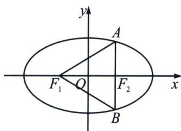

<!-- question-source:start -->
例5 (2024·郴州模拟)已知 $F_{1}$ , $F_{2}$ 是椭圆 $C: \frac{x^{2}}{a^{2}} + \frac{y^{2}}{b^{2}} = 1 (a > b > 0)$ 的左、右焦点, $O$ 是坐标原点, 过 $F_{2}$ 作直线与 $C$ 交于 $A$ , $B$ 两点, 若 $|AF_{1}| = |AB|$ , 且 $\triangle OAF_{2}$ 的面积为 $\frac{\sqrt{3}}{6} b^{2}$ , 则椭圆 $C$ 的离心率为 ( )

A. $\frac{\sqrt{3}}{12}$ B. $\frac{\sqrt{3}}{6}$ C. $\frac{\sqrt{3}}{3}$ D. $\frac{\sqrt{3}}{2}$

<!-- question-source:end -->

![[高中/总复习/专题/2026版高中《mst老唐说题》圆锥曲线专题（数学）/上册/第03章_几何视角下的焦点三角形/第一节_角度语言与坐标语言下的焦点三角形/一_椭圆焦点三角形的性质/例题/answers/Q00048470A1.md]]
