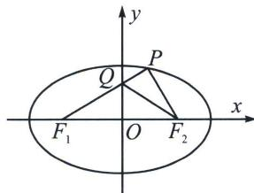

<!-- question-source:start -->
例6 (2024·临沂二模)椭圆 $\frac{x^{2}}{a^{2}}+\frac{y^{2}}{b^{2}}=1(a>b>0)$ 的左、右焦点分别为 $F_{1}, F_{2}, P$ 为椭圆上第一象限内的一点，且 $PF_{1} \perp PF_{2}, PF_{1}$ 与 $y$ 轴相交于点 $Q$ ，离心率 $e=\frac{\sqrt{5}}{3}$ ，若 $\overrightarrow{Q F_{1}}=\lambda \overrightarrow{P F_{1}}$ ，则 $\lambda=$ （）
A. $\frac{3}{8}$ B. $\frac{5}{8}$ C. $\frac{1}{3}$ D. $\frac{2}{3}$

<!-- question-source:end -->

![[高中/总复习/专题/2026版高中《mst老唐说题》圆锥曲线专题（数学）/上册/第03章_几何视角下的焦点三角形/第一节_角度语言与坐标语言下的焦点三角形/一_椭圆焦点三角形的性质/例题/answers/Q00048471A1.md]]
