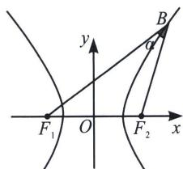

## 二、双曲线焦点三角形性质

双曲线 $\frac{x^2}{a^2} -\frac{y^2}{b^2} = 1(a > 0,b > 0)$ 的焦点为 $F_{1}$ 、 $F_{2}$ ， $B$ 为双曲线上的点， $\angle F_1BF_2 = \alpha$ ，如图，则 $S_{\triangle F_1BF_2} = b^2\cdot \frac{\sin\alpha}{1 - \cos a} = \frac{b^2}{\tan\frac{\alpha}{2}}$ （灵动双曲线焦点三角形面积公式）.

证明：设 $|BF_{1}| = m, |BF_{2}| = n$

$\left\{ \begin{array}{l} |m - n| = 2a① \\ (2c)^2 = m^2 + n^2 - 2mn\cos \alpha ② \\ S_{\triangle F_1BF_2} = \frac{1}{2} mn\sin \alpha ③ \end{array} \right.$ ① $^{2}$ —②得： $mn = \frac{2b^2}{1 - \cos \alpha}$ 代入③，得： $S_{\triangle F_1BF_2} = b^2 \cdot \frac{\sin \alpha}{1 - \cos \alpha} = b^2 \cdot \frac{2\sin \frac{\alpha}{2}\cos \frac{\alpha}{2}}{2\sin^2 \frac{\alpha}{2}} = \frac{b^2}{\tan \frac{\alpha}{2}}.$

面积带动角度与坐标转化：

(1)直角三角等面积法：当 $BF_{1}\perp BF_{2}$ 时，有 $S_{\triangle F_{1}BF_{2}}=b^{2}=\frac{2c|y_{B}|}{2}\Rightarrow|y_{B}|=\frac{b^{2}}{c}$ ; $b^{2}=\frac{mn}{2}\Rightarrow mn=2b^{2}$ ;

(2)任意角度的等面积法：； $S_{\triangle F_1BF_2} = c|y_B| = \frac{b^2}{\tan\frac{\alpha}{2}} = \frac{1}{2}\overrightarrow{BF_1}\cdot \overrightarrow{BF_2}\tan \alpha .$

![[高中/总复习/专题/2026版高中《mst老唐说题》圆锥曲线专题（数学）/上册/第03章_几何视角下的焦点三角形/第一节_角度语言与坐标语言下的焦点三角形/二_双曲线焦点三角形性质/例题/Q00048473.md]]
![[高中/总复习/专题/2026版高中《mst老唐说题》圆锥曲线专题（数学）/上册/第03章_几何视角下的焦点三角形/第一节_角度语言与坐标语言下的焦点三角形/二_双曲线焦点三角形性质/例题/Q00048474.md]]
