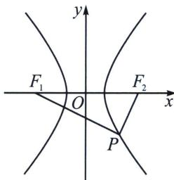

> [!faq]- 《圆锥曲线专题(上册)》例题解析
>
> > [!success]- **【答案】** C
>
> > [!note]- **【解析】**
> > 解析 如下图：由题可知，点 $P$ 必落在第四象限， $\angle F_{1}PF_{2}=90^{\circ}$ ，设 $|PF_{2}|=m$ ， $\angle PF_{2}F_{1}=\theta_{1}$ ， $\angle PF_{1}F_{2}=\theta_{2}$ ，由 $k_{PF_{2}}=\tan\theta_{1}=2$ ，求得 $\sin\theta_{1}=\frac{2}{\sqrt{5}}$ ，
> >
> > 
> >
> > 解法一：因为 $\angle F_{1}PF_{2} = 90^{\circ}$ ，所以 $k_{PF_1}\cdot k_{PF_2} = -1$ ，求得 $k_{PF_1} = -\frac{1}{2}$ ，即 $\tan \theta_{2} = \frac{1}{2},\sin \theta_{2} = \frac{1}{\sqrt{5}}$ ，由正弦定理可得： $|PF_1|\colon |PF_2|\colon |F_1F_2| = \sin \theta_1:\sin \theta_2:\sin 90^\circ = 2:1:\sqrt{5}$ ，则由 $|PF_2| = m$ 得 $|PF_1| = 2m$ $|F_{1}F_{2}| = 2c = \sqrt{5} m$ ，由 $S_{\triangle PF_1F_2} = \frac{1}{2}|PF_1|\cdot |PF_2| = \frac{1}{2} m\cdot 2m = 8$ 得 $m = 2\sqrt{2}$
> >
> > 则 $|PF_{2}| = 2\sqrt{2}$ , $|PF_{1}| = 4\sqrt{2}$ , $|F_{1}F_{2}| = 2c = 2\sqrt{10}$ , $c = \sqrt{10}$ , 由双曲线第一定义可得: $|PF_{1}| - |PF_{2}| = 2a = 2\sqrt{2}$ , $a = \sqrt{2}$ , $b = \sqrt{c^{2} - a^{2}} = \sqrt{8}$ , 所以双曲线的方程为 $\frac{x^2}{2} - \frac{y^2}{8} = 1$ .
> >
> > 解法二： $S_{\triangle PF_{1}F_{2}}=\frac{b^{2}}{\tan\frac{\theta}{2}}\left(\angle F_{1}PF_{2}=\theta=\frac{\pi}{2}\right)$ ，故 $b^{2}=8$ ，由于 $e=\frac{2c}{2a}=\frac{|F_{1}F_{2}|}{|F_{1}F_{2}|(\cos\angle PF_{1}F_{2}-\sin\angle PF_{1}F_{2})}=$ $\frac{1}{\sqrt{5}}=\sqrt{5}, b=2\sqrt{2}, a=\sqrt{5a^{2}-8}=\sqrt{2}$ ，所以双曲线的方程为 $\frac{x^{2}}{2}-\frac{y^{2}}{8}=1$ 。
> >
> > 故选 **C**.
