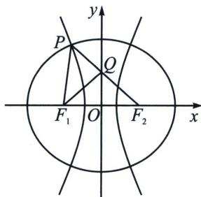

> [!faq]- 《圆锥曲线专题(上册)》例题解析
>
> > [!success]- **【答案】** ABD
>
> > [!note]- **【解析】**
> > 解析 对于 A: 椭圆 $C: \frac{x^{2}}{2} + y^{2} = 1$ 的左右焦点分别为 $F_{1}(-1, 0)$ ， $F_{2}(1, 0)$ ，点 P 在 C 上，所以 $\sqrt{2} - 1 \leqslant |PF_{1}| \leqslant \sqrt{2} + 1$ ，故 A 正确；
> >
> > 对于 B: $\left|PF_{1}\right|\cdot\left|PF_{2}\right|=\frac{2b^{2}}{1+\cos\frac{\pi}{3}}=\frac{4}{3}$ ，故 B 正确；
> >
> > 对于 C：若 $\triangle PF_{1}F_{2}$ 是等腰三角形，若 $\left|F_{1}F_{2}\right|=\left|PF_{1}\right|$ 或 $\left|F_{1}F_{2}\right|=\left|PF_{2}\right|$ ，由对称性可知满足条件的 P 点有 4 个；
> >
> > 若 $\left|PF_{1}\right|=\left|PF_{2}\right|$ ，又 $\left|PF_{1}\right|+\left|PF_{2}\right|=2\sqrt{2}$ ，则 $\left|PF_{1}\right|=\left|PF_{2}\right|=\sqrt{2}$ ，此时点 P 在椭圆的短轴的顶点处，即满足条件的 P 点有 2 个；综上可得，满足条件的 P 点有 6 个，故 C 错误；
> >
> > 对于 D: 记双曲线 M 的实半轴长为 a, P 在第二象限, 所以 $\left|PF_{1}\right|=\sqrt{2}-a$ , $\left|PF_{2}\right|=\sqrt{2}+a$ ,
> >
> > 设 $\angle PF_{1}F_{2}=2\theta$ ，因为 $PF_{2}$ 交 $y$ 轴于点 $Q$ ，且 $F_{1}Q$ 平分 $\angle PF_{1}F_{2}$ ，所以 $\angle QF_{2}F_{1}=\angle QF_{1}F_{2}=\theta$ ，
> >
> > 
> >
> > 解法一：在 $\triangle PF_{1}F_{2}$ 中，由余弦定理可知， $\cos \theta = \frac{|PF_2|^2 + |F_1F_2|^2 - |PF_1|^2}{2|PF_2| \cdot |F_1F_2|} = \frac{(\sqrt{2} + a)^2 + 4 - (\sqrt{2} - a)^2}{4(a + \sqrt{2})} =$ $\frac{\sqrt{2}a + 1}{a + \sqrt{2}}$ ，设 $|QF_1| = |QF_2| = m$ ，则 $|PQ| = |PF_2| - |QF_2| = a + \sqrt{2} - m$ ，由角平分线定理可知， $\frac{|PF_1|}{|F_1F_2|} = \frac{|PQ|}{|QF_2|}$ ，即 $\frac{\sqrt{2} - a}{2} = \frac{a + \sqrt{2} - m}{m}$ ，解得 $m = \frac{2\sqrt{2} + 2a}{2 + \sqrt{2} - a}$ ，在 Rt△ $QOF_2$ 中， $\cos \angle QF_2F_1 = \cos \theta = \frac{|OF_2|}{|QF_2|} = \frac{1}{m} = \frac{2 + \sqrt{2} - a}{2\sqrt{2} + 2a}$ ，所以 $\frac{\sqrt{2}a + 1}{a + \sqrt{2}} = \frac{2 + \sqrt{2} - a}{2\sqrt{2} + 2a}$ ，因为 $0 < a < 1$ ，解得 $a = \frac{4 - \sqrt{2}}{7}$ ，因此，双曲线 $M$ 的离心率 $e = \frac{c}{a} = \frac{1}{\frac{4 - \sqrt{2}}{7}} = \frac{4 + \sqrt{2}}{2}$ ，
> >
> > 解法二(利用倍角三角形): 易知 $\angle PF_{2}F_{1} = \angle QF_{1}F_{2} = \angle PF_{1}Q$ , 则 $B = 2A$ 时, 一定有 $b^{2} = a(a + c)$ , 所以 $|PF_{2}|^{2} = |PF_{1}|\cdot (|PF_{1}| + |F_{1}F_{2}|)$ , $(\sqrt{2} + a)^{2} = (\sqrt{2} - a)(\sqrt{2} - a + 2)$ , $a = \frac{4 - \sqrt{2}}{7}$ , 所以 $e = \frac{c}{a} = \frac{1}{\frac{4 - \sqrt{2}}{7}} = \frac{4 + \sqrt{2}}{2}$
> >
> > 故选 **ABD**.
