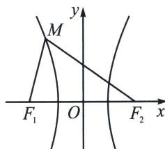

<!-- question-source:start -->
例12 (2024·赣州模拟)已知 $F_{1}, F_{2}$ 为双曲线 $C: \frac{x^{2}}{a^{2}} - \frac{y^{2}}{b^{2}} = 1 (a > 0, b > 0)$ 的左、右焦点， $M$ 为 $C$ 左支上一点。设 $\angle MF_{1}F_{2} = \alpha$ ， $\angle MF_{2}F_{1} = \beta$ ，且 $\sin \frac{\alpha + \beta}{2} = \sqrt{2} \sin \frac{\alpha - \beta}{2}$ ，则 $C$ 的离心率为（）
A. $2 \sqrt{2}$ B. 3
C. 2
D. $\sqrt{2}$

<!-- question-source:end -->

![[高中/总复习/专题/2026版高中《mst老唐说题》圆锥曲线专题（数学）/上册/第03章_几何视角下的焦点三角形/第一节_角度语言与坐标语言下的焦点三角形/四_双曲线焦点三角形两底角半角与离心率转化/例题/answers/Q00048476A1.md]]
