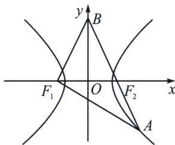

<!-- question-source:start -->
例13（2024·多选·新乡二模）如图，已知双曲线 $C: \frac{x^2}{a^2} - \frac{y^2}{b^2} = 1 (a > 0, b > 0)$ 的左、右焦点分别为 $F_1(-3, 0), F_2(3, 0)$ ，点 $A$ 在 $C$ 上，点 $B$ 在 $y$ 轴上， $A, F_2, B$ 三点共线，若直线 $BF_1$ 的斜率为 $\sqrt{3}$ ，直线 $AF_1$ 的斜率为 $-\frac{5\sqrt{3}}{11}$ ，则 （）

A. $C$ 的渐近线方程为 $y = \pm \frac{\sqrt{5}}{2} x$ B. $|AB| = 16$ C. $\triangle ABF_{1}$ 的面积为 $16\sqrt{3}$ D. $\triangle AF_{1}F_{2}$ 内接圆的半径为 $\sqrt{3}$
<!-- question-source:end -->

![[高中/总复习/专题/2026版高中《mst老唐说题》圆锥曲线专题（数学）/上册/第03章_几何视角下的焦点三角形/第一节_角度语言与坐标语言下的焦点三角形/四_双曲线焦点三角形两底角半角与离心率转化/例题/answers/Q00048477A1.md]]
