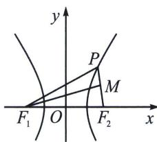

<!-- question-source:start -->
例⑪（2024·嵩明县期中）已知双曲线 C 的左右焦点分别为 $F_{1}$ ， $F_{2}$ ，P 为 C 上一点， $\angle F_{1}PF_{2}=75^{\circ}$ ， $\angle PF_{1}F_{2}=30^{\circ}$ ，则 C 的离心率为（）

第3章 几何视角下的焦点三角形 A. $\frac{\sqrt{2} + \sqrt{3}}{2}$ B. $\frac{1 + 2\sqrt{3}}{2}$ C. $\frac{1 + 2\sqrt{2}}{2}$ D. $\frac{1 + \sqrt{2} + \sqrt{3}}{2}$

<!-- question-source:end -->

![[高中/总复习/专题/2026版高中《mst老唐说题》圆锥曲线专题（数学）/上册/第03章_几何视角下的焦点三角形/第一节_角度语言与坐标语言下的焦点三角形/四_双曲线焦点三角形两底角半角与离心率转化/例题/answers/Q00048954A1.md]]
