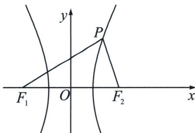
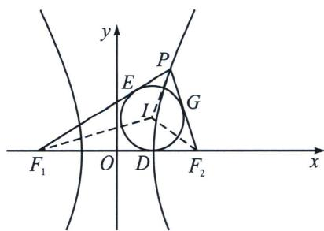

## 四、双曲线焦点三角形两底角半角与离心率转化

已知点 $P$ 是双曲线 $\frac{x^2}{a^2} -\frac{y^2}{b^2} = 1(a > 0,b > 0)$ 右支上除顶点外的一点， $F_{1}$ 、 $F_{2}$ 分别是双曲线的左、右焦点， $\angle PF_1F_2 = \alpha$ ， $\angle PF_2F_1 = \beta$ ，双曲线的离心率为 $e$ ，则 $\frac{\tan\frac{\alpha}{2}}{\tan\frac{\beta}{2}} = \frac{e - 1}{e + 1}$

证明： $e = \frac{c}{a} = \frac{2c}{2a} = \frac{|F_1F_2|}{|PF_1| - |PF_2|} = \frac{\sin(\alpha + \beta)}{\sin\beta - \sin\alpha} = \frac{\sin 2\left(\frac{\alpha + \beta}{2}\right)}{\sin\left(\frac{\alpha + \beta}{2} - \frac{\alpha - \beta}{2}\right) - \sin\left(\frac{\alpha + \beta}{2} + \frac{\alpha - \beta}{2}\right)} = -\frac{\sin\frac{\alpha + \beta}{2}}{\sin\frac{\alpha - \beta}{2}} =$ $\frac{\tan\frac{\alpha}{2} + \tan\frac{\beta}{2}}{-\tan\frac{\alpha}{2} + \tan\frac{\beta}{2}},$ 故 $\frac{\tan\frac{\alpha}{2}}{\tan\frac{\beta}{2}} = \frac{e - 1}{e + 1};$

注意 本结论涉及双曲线的焦点三角形内心定理，知识点纵横交错形成为了命题的高密集区域.

双曲线的内心轨迹

已知双曲线 $\frac{x^2}{a^2} -\frac{y^2}{b^2} = 1$ ，则焦点三角形 $PF_{1}F_{2}$ 的内心 $I$ 的轨迹是： $x = \pm a$ ，和长轴的两个顶点相切.

证明：如上右图所示，以点 $P$ 在右支上为例，设内切圆 $I$ 和焦点三角形 $PF_{1}F_{2}$ 的三边分别切于点 $D$ 、 $E$ 、 $G$ ，则 $2a = |PF_{1}| - |PF_{2}| = |EF_{1}| - |GF_{2}| = |DF_{1}| - |DF_{2}|$ ，又 $|DF_{1}| + |DF_{2}| = 2c$ ，故 $\left\{ \begin{array}{l} |DF_{1}| = a + c \\ |DF_{2}| = c - a \end{array} \right.$ ，

所以 $|OD| = a$ ，点 $D$ 恰好和双曲线的端点重合，圆心 $I$ 在直线 $x = a$ 上．我们同样可以证明： $\frac{\tan\frac{\alpha}{2}}{\tan\frac{\beta}{2}} =$

$$
\frac {\frac {r}{| F _ {1} D |}}{\frac {r}{| F _ {2} D |}} = \frac {| F _ {2} D |}{| F _ {1} D |} = \frac {c - a}{c + a} = \frac {e - 1}{e + 1}.
$$

对比椭圆，类比焦点三角形面积公式，我们可以记忆为椭圆乘 $\tan \frac{\alpha}{2} \cdot \tan \frac{\beta}{2} = \frac{1 - e}{1 + e}$ ，双曲线除 $\frac{\tan \frac{\alpha}{2}}{\tan \frac{\beta}{2}} = \frac{e - 1}{e + 1}$ .

![[高中/总复习/专题/2026版高中《mst老唐说题》圆锥曲线专题（数学）/上册/第03章_几何视角下的焦点三角形/第一节_角度语言与坐标语言下的焦点三角形/四_双曲线焦点三角形两底角半角与离心率转化/例题/Q00048954.md]]
![[高中/总复习/专题/2026版高中《mst老唐说题》圆锥曲线专题（数学）/上册/第03章_几何视角下的焦点三角形/第一节_角度语言与坐标语言下的焦点三角形/四_双曲线焦点三角形两底角半角与离心率转化/例题/Q00048476.md]]
![[高中/总复习/专题/2026版高中《mst老唐说题》圆锥曲线专题（数学）/上册/第03章_几何视角下的焦点三角形/第一节_角度语言与坐标语言下的焦点三角形/四_双曲线焦点三角形两底角半角与离心率转化/例题/Q00048477.md]]
